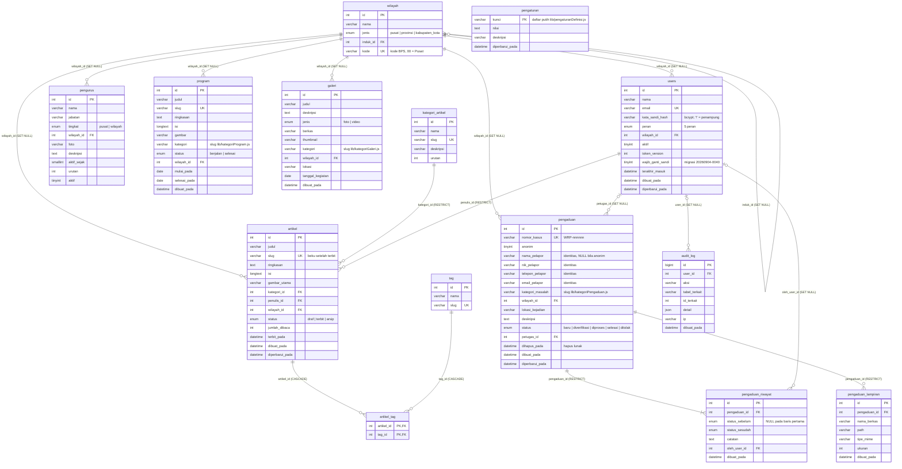

# DATABASE.md — Basis data WARKOP NUSANTARA

Dokumentasi akhir basis data (Tahap 9 bagian F). Menggantikan versi Tahap 1.
Seluruh isi diturunkan dari berkas di repo: `database/schema.sql`,
`database/seed.sql`, `database/migrations/`, `scripts/seed.js`,
`scripts/cadangkan-db.sh`, `lib/db/*.js`, `lib/pengaturanDefinisi.js`,
`lib/kategoriPengaduan.js`, `lib/kategoriProgram.js`, `lib/kategoriGaleri.js`,
`lib/auth/hakAkses.js`, `PENERAPAN.md` bagian G, dan `dokumen/REFERENSI.md`
bagian 10–11. Ketidaksesuaian antar berkas dicatat di bagian 8.

Daftar isi: 1 Gambaran · 2 Diagram relasi · 3 Tabel · 4 Keputusan `ON DELETE` ·
5 Enum dan nilai tetap · 6 Migrasi dan pemeriksaan integritas · 7 Pencadangan
dan pemulihan · 8 Catatan ketidaksesuaian.

---

## 1. Gambaran

| Hal | Nilai | Sumber |
|---|---|---|
| Mesin | MariaDB 11 (`image: mariadb:11`), container terpisah dari aplikasi | `docker-compose.yml`, REFERENSI 10 |
| Engine tabel | InnoDB, seluruh tabel | `database/schema.sql` |
| Charset / collation | `utf8mb4` / `utf8mb4_unicode_ci` (per tabel, `SET NAMES` di awal skema, `charset` pada pool) | `schema.sql`, `lib/db/index.js` |
| Nama basis data | dari ENV `DB_NAME`; nilai yang dipakai seluruh dokumen dan skrip: `warkop_nusantara` (pengguna `warkop`) | `PENERAPAN.md` 1.1 dan G, `scripts/cadangkan-db.sh` |
| Jumlah tabel | 14 (daftar putih `TABEL_DIKENAL` di `lib/db/index.js`) | `lib/db/index.js` |
| Pustaka akses | `mysql2/promise`, pool tunggal lazy, `connectionLimit` = `DB_POOL_LIMIT` (bawaan 10), `connectTimeout` 5 detik | `lib/db/index.js` |
| Klien SQL | tidak ada ORM; seluruh SQL ada di `lib/db/*.js`; route API tidak pernah menulis SQL | `lib/db/index.js` |

### 1.1 Zona waktu — server UTC, sesi +07:00, kolom berisi WIB

Diterapkan persis seperti `lib/db/index.js` dan aturan REFERENSI 10:

1. **Server MariaDB boleh UTC.** `docker-compose.yml` menyetel `TZ: UTC` pada
   layanan `db` dengan komentar "server DB sengaja UTC — aplikasi menyetel
   +07:00 per koneksi"; `PENERAPAN.md` G.4 menyebut hasil
   `SELECT @@system_time_zone, NOW()` di server "boleh UTC".
2. **Pool menyetel `timezone: '+07:00'`** — mysql2 menafsirkan/menulis nilai
   `DATETIME` sebagai WIB saat mengonversi ke/dari objek `Date`.
3. **Hook `pool.on('connection')` menjalankan `SET time_zone = '+07:00'`** pada
   SETIAP koneksi baru, sehingga `NOW()`/`CURRENT_TIMESTAMP` di sisi server
   juga WIB. Komentar kode: hook ini "WAJIB dan tidak boleh dilewat".
   `jalankanSkripSql()` (dipakai seed) membuka koneksi terpisah dan menjalankan
   `SET time_zone` yang sama.
4. **Kolom waktu bertipe `DATETIME` tanpa `DEFAULT CURRENT_TIMESTAMP`.** Nilai
   diisi aplikasi lewat `lib/utils.js waktuSekarang()` yang menghasilkan string
   `YYYY-MM-DD HH:mm:ss` dalam WIB dari UTC+7 — tidak bergantung zona waktu
   mesin. `schema.sql` dan `seed.sql` juga diawali `SET time_zone = '+07:00'`
   dan seluruh nilai waktu di seed ditulis eksplisit dalam WIB (tanpa `NOW()`).

Akibatnya **nilai yang tersimpan di kolom `DATETIME` adalah jam dinding WIB**.
Bila membaca lewat klien `mariadb` tanpa `SET time_zone = '+07:00'`, angka
kolom tetap tampil WIB (DATETIME tidak dikonversi), tetapi `NOW()` klien itu
UTC — jangan membandingkan keduanya tanpa menyetel sesi lebih dulu.

### 1.2 Cara skema dibuat (PENERAPAN.md bagian G dan 1)

| Lingkungan | Skema | Data awal |
|---|---|---|
| Produksi (G.1) | `docker exec -i <container_db> mariadb ... warkop_nusantara < sql/01-schema.sql` — sekali, pada basis data kosong | `docker exec -i <container_app> node scripts/seed.js` (idempoten) |
| Lokal container mandiri (1.1) | `Get-Content sql\01-schema.sql -Raw \| docker exec -i warkop-mariadb mariadb ...` | `npm run seed` |
| Lokal compose (1.2) | `./sql` dipasang ke `/docker-entrypoint-initdb.d` — MariaDB menjalankan **seluruh** `sql/*.sql` saat volume kosong | `docker compose exec app node scripts/seed.js` |

`sql/01-schema.sql` dan `sql/02-seed.sql` adalah salinan identik
`database/schema.sql` dan `database/seed.sql` (diverifikasi `diff` saat
menulis dokumen ini: tidak ada perbedaan). `sql/03-users-wajib-ganti-sandi.sql`
identik dengan `database/migrations/20260904-0040-users-wajib-ganti-sandi.sql`
dan **wajib dijalankan manual** pada basis data yang dibuat dari `01` saja
(lihat bagian 6 dan 8).

### 1.3 Pola akses di `lib/db/`

| Fungsi (`lib/db/index.js`) | Peran |
|---|---|
| `db()` | pool tunggal (lazy), dibuat sekali per proses |
| `kueri(sql, params, koneksi?)` | **satu-satunya** jalan menjalankan SQL: `execute()` = prepared statement dengan placeholder `?`; parameter dikirim terpisah dari SQL. `DB_LOG_KUERI=1` mencetak SQL ke stdout untuk uji penyaringan identitas/wilayah |
| `transaksi(fn)` | `beginTransaction` → `fn(koneksi)` → `commit`; galat apa pun → `rollback` seluruhnya |
| `periksaKoneksi()` | `SELECT 1` untuk `/api/health` (200/503) |
| `hitungTabelAda()`, `hitungBaris()` | hanya nama dari daftar putih `TABEL_DIKENAL` (bukan masukan pengguna) — dipakai `scripts/seed.js` |
| `jalankanSkripSql(teks)` | koneksi `multipleStatements` untuk menjalankan `database/seed.sql` — hanya skrip CLI |
| `tutupPool()` | menutup pool di skrip CLI |

Modul per tabel: `users.js`, `wilayah.js`, `artikel.js` (juga
`kategori_artikel`, `tag`, `artikel_tag`), `pengaduan.js` (juga
`pengaduan_riwayat`, `pengaduan_lampiran`), `pengurus.js`, `program.js`,
`galeri.js`, `pengaturan.js`, `audit.js`, `statistik.js` (agregat dashboard).
Pembatasan peran (kepemilikan penulis, wilayah `pimpinan_wilayah`, kolom
identitas) ditegakkan **di klausa SQL**, bukan disaring di JavaScript.

### 1.4 Berkas

| Berkas | Isi |
|---|---|
| `database/schema.sql` = `sql/01-schema.sql` | 14 `CREATE TABLE IF NOT EXISTS` (idempoten) |
| `database/seed.sql` = `sql/02-seed.sql` | data awal idempoten (`INSERT IGNORE` pada kunci unik / `WHERE NOT EXISTS`): 1 pusat + 38 provinsi, 5 kategori artikel, 5 akun staf contoh nonaktif (hash `'!'`), 13 pengaturan bawaan, 12 artikel contoh, 5 tag, 3 pengaduan contoh + riwayat pertama, pengurus, 3 program, 6 galeri. **Tidak ada kata sandi** di berkas ini |
| `scripts/seed.js` (`npm run seed`) | superadmin dari `SEED_ADMIN_EMAIL`/`SEED_ADMIN_PASSWORD` (bcrypt 12 putaran; sandi tidak diubah bila akun sudah ada kecuali `SEED_RESET_ADMIN=1`) → menjalankan `seed.sql` → mengaktifkan akun contoh hanya bila `SEED_STAF_PASSWORD` terisi → perpindahan status pengaduan contoh **lewat `ubahStatusPengaduan()`** (hanya bila masih `baru` dengan 1 riwayat) → ringkasan jumlah baris |
| `database/migrations/*.sql` = `sql/03-*.sql` | migrasi setelah basis data berjalan (bagian 6) |
| `scripts/cadangkan-db.sh` | dump terkompresi bertanggal WIB (bagian 7) |

---

## 2. Diagram relasi



---

## 3. Tabel

Konvensi seluruh tabel (REFERENSI 10, header `schema.sql`): `id INT UNSIGNED
AUTO_INCREMENT` (kecuali `audit_log` = `BIGINT UNSIGNED`, `pengaturan` =
`kunci` sebagai PK, `artikel_tag` = PK gabungan); kolom waktu `DATETIME` diisi
aplikasi; `utf8mb4_unicode_ci`; `CREATE TABLE IF NOT EXISTS`.

### 3.1 `wilayah` — pusat, provinsi, kabupaten/kota

Tujuan: hierarki wilayah untuk penyaringan `pimpinan_wilayah` dan `<select>`
provinsi di formulir pengaduan.

| Kolom | Tipe | Arti |
|---|---|---|
| id | INT UNSIGNED PK | |
| nama | VARCHAR(100) NOT NULL | |
| jenis | ENUM('pusat','provinsi','kabupaten_kota') NOT NULL | |
| induk_id | INT UNSIGNED NULL → `wilayah.id` (SET NULL) | hierarki: provinsi → pusat |
| kode | VARCHAR(10) NULL, UNIQUE `uq_wilayah_kode` | kode BPS provinsi; `'00'` = Pusat |

Indeks: `idx_wilayah_induk (induk_id)`, `idx_wilayah_jenis (jenis)`.
Seed: 1 baris `Pusat` + 38 provinsi (kode BPS). `lib/db/wilayah.js` hanya
membaca (`ambilProvinsi`, `ambilWilayahByKode`) — tidak ada jalur tulis dari
aplikasi; wilayah diisi lewat seed/SQL manual.

### 3.2 `users` — akun staf

Tujuan: akun ruang staf. Peran terkunci sebagai ENUM (keputusan pemilik, 5
peran). Akun **dinonaktifkan** (`aktif = 0`), tidak dihapus — lihat catatan
bagian 8 butir 4.

| Kolom | Tipe | Arti |
|---|---|---|
| id | INT UNSIGNED PK | |
| nama | VARCHAR(100) NOT NULL | |
| email | VARCHAR(190) NOT NULL, UNIQUE `uq_users_email` | disimpan huruf kecil (`trim().toLowerCase()` di `users.js`) |
| kata_sandi_hash | VARCHAR(100) NOT NULL | bcrypt 12 putaran (`scripts/seed.js`); `'!'` = penampung akun contoh yang tidak mungkin cocok. Hanya di-SELECT oleh `cariUserByEmail()` untuk login |
| peran | ENUM('superadmin','redaktur','penulis','verifikator','pimpinan_wilayah') NOT NULL | bagian 5.1 |
| wilayah_id | INT UNSIGNED NULL → `wilayah.id` (SET NULL) | wajib bermakna untuk `pimpinan_wilayah`; bila NULL, `wilayahTerbatas()` mengembalikan `-1` = tidak melihat apa pun |
| aktif | TINYINT(1) NOT NULL DEFAULT 1 | 0 = tidak bisa masuk |
| token_version | INT UNSIGNED NOT NULL DEFAULT 0 | **WAJIB** (cetak biru 8): dinaikkan `naikkanTokenVersion()` = seluruh JWT lama pengguna itu batal. Dinaikkan juga oleh `setelUlangSandiOlehAdmin()` dan `setelUlangSuperadmin()` |
| wajib_ganti_sandi | TINYINT(1) NOT NULL DEFAULT 0 | **ditambahkan migrasi `20260904-0040`** (Tahap 7): 1 = wajib ganti sandi saat login berikutnya (disetel reset oleh superadmin; dihapus `gantiSandiSendiri()`). Dibaca layout staf (`wajibGantiSandi`) |
| terakhir_masuk | DATETIME NULL | `catatTerakhirMasuk()` |
| dibuat_pada, diperbarui_pada | DATETIME NOT NULL | diisi aplikasi |

Indeks: `idx_users_peran (peran)`, `idx_users_wilayah (wilayah_id)`.
Aturan lain di `users.js`/route: `hitungSuperadminAktif()` mencegah
menonaktifkan/menghapus superadmin aktif terakhir; kolom aman (`KOLOM_AMAN`)
tidak pernah menyertakan `kata_sandi_hash`.

### 3.3 `kategori_artikel`

| Kolom | Tipe | Arti |
|---|---|---|
| id | INT UNSIGNED PK | |
| nama | VARCHAR(80) NOT NULL | |
| slug | VARCHAR(80) NOT NULL, UNIQUE `uq_kategori_artikel_slug` | filter publik `?kategori=` |
| deskripsi | VARCHAR(255) NULL | |
| urutan | INT NOT NULL DEFAULT 0 | urutan tampil |

Seed 5 kategori (REFERENSI 10): Investigasi, Siaran Pers, Opini Publik,
Kegiatan Daerah, Fasilitas Umum. Tidak ada jalur tulis dari aplikasi.

### 3.4 `artikel`

Tujuan: berita/investigasi. Alur status di `lib/db/artikel.js`.

| Kolom | Tipe | Arti |
|---|---|---|
| id | INT UNSIGNED PK | |
| judul | VARCHAR(255) NOT NULL | |
| slug | VARCHAR(255) NOT NULL, UNIQUE `uq_artikel_slug` | dari `buatSlug(judul)` + akhiran `-2, -3, …` bila bentrok (`slugUnik`). **Beku setelah terbit**: `perbaruiArtikel()` hanya mengganti slug bila `terbit_pada IS NULL` (tautan yang sudah tersebar tidak putus) |
| ringkasan | TEXT NULL | |
| isi | LONGTEXT NOT NULL | HTML tersanitasi (isomorphic-dompurify, Tahap 5) |
| gambar_utama | VARCHAR(255) NULL | jalur unggahan |
| kategori_id | INT UNSIGNED NOT NULL → `kategori_artikel.id` (RESTRICT) | aturan 7: tidak ada artikel tanpa kategori |
| penulis_id | INT UNSIGNED NOT NULL → `users.id` (RESTRICT) | atribusi tetap ada walau akun nonaktif |
| wilayah_id | INT UNSIGNED NULL → `wilayah.id` (SET NULL) | penyaringan `pimpinan_wilayah` |
| status | ENUM('draf','terbit','arsip') NOT NULL DEFAULT 'draf' | bagian 5.4 |
| jumlah_dibaca | INT UNSIGNED NOT NULL DEFAULT 0 | `naikkanJumlahDibaca()`; modul "Paling Banyak Dibaca" |
| terbit_pada | DATETIME NULL | diisi `terbitkanArtikel()` dengan `COALESCE(terbit_pada, ?)` — hanya saat **pertama** terbit; tidak direset oleh arsip/draf |
| dibuat_pada, diperbarui_pada | DATETIME NOT NULL | |

Indeks: `idx_artikel_status_terbit (status, terbit_pada DESC)` (daftar publik
`WHERE status='terbit' ORDER BY terbit_pada DESC`), `idx_artikel_kategori`,
`idx_artikel_penulis`, `idx_artikel_wilayah`.
Pembatasan di SQL (`ambilArtikelStaf`): `penulis` → `a.penulis_id = ?`;
`pimpinan_wilayah` → `a.wilayah_id = ?`. `hapusArtikel()` = DELETE fisik
(relasi `artikel_tag` ikut CASCADE).

### 3.5 `tag`, `artikel_tag` — banyak-ke-banyak

| Tabel | Kolom |
|---|---|
| `tag` | id PK; nama VARCHAR(60); slug VARCHAR(60) UNIQUE `uq_tag_slug` |
| `artikel_tag` | artikel_id → `artikel.id` (CASCADE); tag_id → `tag.id` (CASCADE); PK (artikel_id, tag_id); indeks `idx_artikel_tag_tag (tag_id)` |

`simpanTag()` (dalam transaksi artikel): hapus relasi lama → `INSERT IGNORE`
tag berdasarkan slug → `INSERT IGNORE artikel_tag`.

### 3.6 `pengaduan` — DATA SENSITIF

Tujuan: laporan masyarakat (boleh anonim). Aturan 3 CLAUDE.md dan aturan 13
REFERENSI ditegakkan **di SQL** oleh `lib/db/pengaduan.js`.

| Kolom | Tipe | Arti |
|---|---|---|
| id | INT UNSIGNED PK | |
| nomor_kasus | VARCHAR(16) NOT NULL, UNIQUE `uq_pengaduan_nomor` | `WRP-` + 6 digit dari `crypto.randomInt(0, 1e6)` (CSPRNG, tidak berurutan). Keunikan = UNIQUE KEY + ulang hingga 10 kali saat `ER_DUP_ENTRY` di dalam transaksi `buatPengaduan()` |
| anonim | TINYINT(1) NOT NULL DEFAULT 0 | **1 = keempat kolom identitas DIPAKSA NULL** apa pun masukannya (`identitas = anon ? [null×4] : [...]`) |
| nama_pelapor | VARCHAR(150) NULL | identitas |
| nik_pelapor | VARCHAR(16) NULL | identitas; validasi 16 digit di `lib/validasi/pengaduan.js` |
| telepon_pelapor | VARCHAR(30) NULL | identitas |
| email_pelapor | VARCHAR(190) NULL | identitas |
| kategori_masalah | VARCHAR(50) NOT NULL | slug `lib/kategoriPengaduan.js` (VARCHAR, bukan ENUM: tambah kategori tanpa migrasi) |
| wilayah_id | INT UNSIGNED NULL → `wilayah.id` (SET NULL) | provinsi; penyaringan `pimpinan_wilayah` = `WHERE p.wilayah_id = ?` |
| lokasi_kejadian | VARCHAR(200) NULL | teks bebas "Wilayah Kejadian" dari formulir (KEPUTUSAN BARU Tahap 1) |
| deskripsi | TEXT NOT NULL | |
| status | ENUM('baru','diverifikasi','diproses','selesai','ditolak') NOT NULL DEFAULT 'baru' | **hanya berubah lewat `ubahStatusPengaduan()`** (bagian 3.8) |
| petugas_id | INT UNSIGNED NULL → `users.id` (SET NULL) | `tugaskanPetugas()`; kandidat = verifikator/superadmin aktif |
| dihapus_pada | DATETIME NULL | **penghapusan lunak** (KEPUTUSAN BARU Tahap 1): seluruh kueri baca memakai `WHERE dihapus_pada IS NULL`; tidak ada DELETE fisik (FK RESTRICT dari riwayat/lampiran menolaknya). Lihat bagian 8 butir 2 |
| dibuat_pada, diperbarui_pada | DATETIME NOT NULL | |

Indeks: `idx_pengaduan_status_dibuat (status, dibuat_pada DESC)`,
`idx_pengaduan_wilayah`, `idx_pengaduan_petugas`, `idx_pengaduan_kategori`.

**Siapa yang boleh membaca kolom identitas** — `kolomUntuk(bolehLihatIdentitas)`
di `lib/db/pengaduan.js`:

| Himpunan kolom | Isi | Dipakai oleh |
|---|---|---|
| `KOLOM_UMUM` | id, nomor_kasus, anonim, kategori_masalah, wilayah_id, wilayah_nama, lokasi_kejadian, deskripsi, status, petugas_id, petugas_nama, dibuat_pada, diperbarui_pada | semua peran yang punya `HAK.pengaduan_lihat` (superadmin, verifikator, pimpinan_wilayah) |
| `KOLOM_UMUM + KOLOM_IDENTITAS` | + nama_pelapor, nik_pelapor, telepon_pelapor, email_pelapor | hanya bila `bolehLihatIdentitas === true`, yaitu peran di `HAK.pengaduan_identitas` = **`superadmin`, `verifikator`** (`bolehLihatIdentitas(peran)` di `lib/auth/hakAkses.js`, dihitung dari peran, bukan dari permintaan) |
| `KOLOM_PUBLIK` | nomor_kasus, kategori_masalah, wilayah_nama, status, dibuat_pada, diperbarui_pada | pelacakan publik `ambilPengaduanByNomor()`; kartu beranda `ambilKasusBerjalanPublik()`; dashboard `pengaduanTerbaru()` |

Bila `bolehLihatIdentitas` false, kolom identitas **tidak ada di kueri sama
sekali** (bukan dihapus setelah diambil). Setiap pembukaan identitas ditulis
`audit_log` dengan aksi `lihat_identitas_pelapor` (route GET detail dan
halaman detail staf). Balasan `POST .../status` dan siaran Socket.io tidak
pernah menyertakan identitas.

### 3.7 `pengaduan_lampiran` — bukti

| Kolom | Tipe | Arti |
|---|---|---|
| id | INT UNSIGNED PK | |
| pengaduan_id | INT UNSIGNED NOT NULL → `pengaduan.id` (RESTRICT) | bukti tidak ikut lenyap |
| nama_berkas | VARCHAR(255) NOT NULL | nama tersimpan (diganti acak oleh aplikasi, Tahap 6) |
| path | VARCHAR(255) NOT NULL | subfolder `pengaduan/<24 hex acak>` di volume unggahan |
| tipe_mime | VARCHAR(100) NOT NULL | diverifikasi magic bytes: jpg/png/webp/pdf/mp4 |
| ukuran | INT UNSIGNED NOT NULL | byte |
| dibuat_pada | DATETIME NOT NULL | |

Indeks: `idx_lampiran_pengaduan (pengaduan_id)`. Batas di
`app/api/pengaduan/route.js`: maks 5 berkas, `UPLOAD_MAX_MB` per berkas
(bawaan 20 MB), total 40 MB; validasi dilakukan **sebelum** pengaduan dibuat.
Lampiran hanya bisa dibaca lewat route staf terjaga
`/api/staf/pengaduan/[id]/lampiran/[lampiranId]` (audit
`lihat_lampiran_pengaduan`), tidak pernah disajikan statis.

### 3.8 `pengaduan_riwayat` — BUKU BESAR

Tujuan: setiap perpindahan status pengaduan tercatat dengan nilai sebelum dan
sesudah (cetak biru bagian 7; padanan `mutasi_saldo` Cap Jiki).

| Kolom | Tipe | Arti |
|---|---|---|
| id | INT UNSIGNED PK | |
| pengaduan_id | INT UNSIGNED NOT NULL → `pengaduan.id` (RESTRICT) | buku besar tidak boleh lenyap |
| status_sebelum | ENUM(status) NULL | **NULL hanya pada baris pertama** (laporan dibuat) |
| status_sesudah | ENUM(status) NOT NULL | |
| catatan | TEXT NULL | alasan perubahan. Baris pertama: `'Laporan diterima'`. Di route API catatan **wajib** ≥ `CATATAN_MIN` = 10 karakter (422 `CATATAN_WAJIB`) — lihat bagian 8 butir 3 |
| oleh_user_id | INT UNSIGNED NULL → `users.id` (SET NULL) | NULL = sistem/pelapor (baris pertama) |
| dibuat_pada | DATETIME NOT NULL | |

Indeks: `idx_riwayat_pengaduan_waktu (pengaduan_id, dibuat_pada)`,
`idx_riwayat_oleh (oleh_user_id)`.

Aturan yang ditegakkan kode:

1. **Tidak ada pengaduan tanpa riwayat** — `buatPengaduan()` menyisipkan
   pengaduan dan baris riwayat pertama (`NULL → 'baru'`) dalam satu transaksi.
   `seed.sql` melakukan hal yang sama untuk 3 pengaduan contoh dengan
   `INSERT ... WHERE NOT EXISTS`.
2. **`ubahStatusPengaduan()` adalah satu-satunya jalan mengubah
   `pengaduan.status`**, urutannya: buka transaksi → `SELECT id, status ...
   FOR UPDATE` (cegah balapan) → `UPDATE pengaduan SET status, diperbarui_pada`
   → `INSERT pengaduan_riwayat (status_sebelum = status lama, status_sesudah,
   catatan, oleh_user_id)` → commit; galat apa pun = rollback seluruhnya.
   Komentar kode: "Fungsi lain yang menyentuh kolom status = CACAT" —
   termasuk seed (`scripts/seed.js` memakai fungsi ini) dan SQL manual
   (`PENERAPAN.md` G.2 melarang mengubah `pengaduan.status` lewat SQL).
3. **Rantai tidak boleh putus** (invarian yang diperiksa kueri bagian 6.4):
   `status_sesudah` baris N = `status_sebelum` baris N+1 (urut `dibuat_pada`,
   `id`); baris pertama `status_sebelum IS NULL` dan `status_sesudah = 'baru'`;
   `status_sesudah` baris terakhir = `pengaduan.status`.
4. Pelacakan publik hanya menampilkan `status_sebelum, status_sesudah,
   dibuat_pada` (tanpa catatan, tanpa pelaku); staf melihat `ambilRiwayat()`
   lengkap dengan `oleh_nama`.

### 3.9 `pengurus` — struktur organisasi

| Kolom | Tipe | Arti |
|---|---|---|
| id | INT UNSIGNED PK | |
| nama | VARCHAR(150) NOT NULL | |
| jabatan | VARCHAR(100) NOT NULL | |
| tingkat | ENUM('pusat','wilayah') NOT NULL | |
| wilayah_id | INT UNSIGNED NULL → `wilayah.id` (SET NULL) | |
| foto | VARCHAR(255) NULL | |
| deskripsi | TEXT NULL | |
| aktif_sejak | SMALLINT UNSIGNED NULL | tahun |
| urutan | INT NOT NULL DEFAULT 0 | `simpanUrutanPengurus()` menulis 1..n dalam satu transaksi (Tahap 7) |
| aktif | TINYINT(1) NOT NULL DEFAULT 1 | publik hanya `aktif = 1`, urut `FIELD(tingkat,'pusat','wilayah'), urutan, nama` |

Indeks: `idx_pengurus_tingkat_urutan (tingkat, urutan)`, `idx_pengurus_wilayah`.
Seed: nama pengurus regional pada export desain diganti nama fiktif (KEPUTUSAN
BARU di `seed.sql`). `hapusPengurus()` = DELETE fisik.

### 3.10 `program`

| Kolom | Tipe | Arti |
|---|---|---|
| id | INT UNSIGNED PK | |
| judul | VARCHAR(255) NOT NULL | |
| slug | VARCHAR(255) NOT NULL, UNIQUE `uq_program_slug` | `slugUnik()`; **ikut berubah** saat judul diubah (`perbaruiProgram`) — berbeda dari artikel |
| ringkasan | TEXT NULL | |
| isi | LONGTEXT NULL | |
| gambar | VARCHAR(255) NULL | |
| kategori | VARCHAR(50) NOT NULL | slug `lib/kategoriProgram.js` |
| status | ENUM('berjalan','selesai') NOT NULL DEFAULT 'berjalan' | |
| wilayah_id | INT UNSIGNED NULL → `wilayah.id` (SET NULL) | |
| mulai_pada, selesai_pada | DATE NULL | urutan daftar publik `mulai_pada` |
| dibuat_pada | DATETIME NOT NULL | |

Indeks: `idx_program_status_mulai (status, mulai_pada DESC)`,
`idx_program_kategori`, `idx_program_wilayah`. `hapusProgram()` = DELETE fisik.

### 3.11 `galeri`

| Kolom | Tipe | Arti |
|---|---|---|
| id | INT UNSIGNED PK | |
| judul | VARCHAR(255) NOT NULL | |
| deskripsi | TEXT NULL | |
| jenis | ENUM('foto','video') NOT NULL DEFAULT 'foto' | |
| berkas | VARCHAR(255) NOT NULL | |
| thumbnail | VARCHAR(255) NULL | |
| kategori | VARCHAR(50) NOT NULL | slug `lib/kategoriGaleri.js` |
| wilayah_id | INT UNSIGNED NULL → `wilayah.id` (SET NULL) | |
| lokasi | VARCHAR(150) NULL | teks lokasi kegiatan, mis. "Balai Desa, Kab. Bogor" (KEPUTUSAN BARU Tahap 1) |
| tanggal_kegiatan | DATE NULL | filter rentang & urutan |
| dibuat_pada | DATETIME NOT NULL | |

Indeks: `idx_galeri_tanggal (tanggal_kegiatan DESC)`, `idx_galeri_kategori`,
`idx_galeri_wilayah`. `hapusGaleri()` = DELETE fisik.

### 3.12 `pengaturan` — kunci-nilai

| Kolom | Tipe | Arti |
|---|---|---|
| kunci | VARCHAR(64) PK | **hanya kunci dari daftar putih** `KUNCI_PENGATURAN` (`lib/pengaturanDefinisi.js`, aturan 8) |
| nilai | TEXT NULL | selalu string (`String(nilai)`); tipe tampilan (`teks`/`angka`/`teks_panjang`) ada di definisi, bukan di DB |
| deskripsi | VARCHAR(255) NULL | |
| diperbarui_pada | DATETIME NOT NULL | |

`ambilPengaturan()` mengisi kunci yang belum ada di DB dengan nilai bawaan
definisi (tampilan tidak pernah kosong); `simpanPengaturan()` **menolak dengan
galat `KUNCI_TIDAK_SAH`** kunci di luar daftar putih (bukan diabaikan diam-
diam), lalu `INSERT ... ON DUPLICATE KEY UPDATE`.

Daftar putih (13 kunci; `seed.sql` memuat ke-13 nilai bawaan yang sama):

| Kelompok | Kunci |
|---|---|
| statistik | `statistik_laporan_ditangani`, `statistik_provinsi_tercover`, `statistik_tahun_mengawasi` |
| kontak | `kontak_email`, `kontak_hotline`, `kontak_alamat_gedung`, `kontak_alamat_jalan`, `kontak_alamat_kota` |
| profil | `visi`, `misi` |
| halaman_statis | `teks_kebijakan_privasi`, `teks_pedoman_komunitas`, `teks_faq` |

Menambah setelan = menambah **satu** entri di `pengaturanDefinisi.js` (tidak
perlu migrasi; baris DB dibuat saat pertama disimpan atau lewat seed).

### 3.13 `audit_log` — jejak tindakan staf

| Kolom | Tipe | Arti |
|---|---|---|
| id | BIGINT UNSIGNED PK | |
| user_id | INT UNSIGNED NULL → `users.id` (SET NULL) | NULL untuk aksi publik (`pengaduan_masuk`) |
| aksi | VARCHAR(60) NOT NULL | lihat daftar di bawah |
| tabel_terkait | VARCHAR(40) NULL | |
| id_terkait | INT UNSIGNED NULL | |
| detail | JSON NULL | diserialisasi `JSON.stringify`; **dilarang memuat identitas pelapor** (komentar `audit.js`) |
| ip | VARCHAR(45) NULL | IPv4/IPv6 |
| dibuat_pada | DATETIME NOT NULL | |

Indeks: `idx_audit_user_waktu (user_id, dibuat_pada)`,
`idx_audit_terkait (tabel_terkait, id_terkait)`. Hanya `catatAudit()` yang
menulis; `ambilAktivitasTerbaru()` untuk dashboard (tanpa `detail`). Tidak ada
jalur hapus.

Nilai `aksi` yang ditulis kode saat ini (hasil pencarian `catatAudit(` di
`app/` dan `lib/`): `login_berhasil`, `login_gagal`, `logout`,
`ganti_sandi_sendiri`, `pengaduan_masuk`, `lihat_identitas_pelapor`,
`lihat_lampiran_pengaduan`, `pengaduan_ubah_status`, `pengaduan_tugaskan`,
`artikel_buat`, `artikel_sunting`, `artikel_terbit`, `artikel_arsip`,
`artikel_ke_draf`, `artikel_hapus`, `galeri_buat`, `galeri_ubah`,
`galeri_hapus`, `pengurus_buat`, `pengurus_ubah`, `pengurus_hapus`,
`pengurus_urutan`, `program_buat`, `program_ubah`, `program_hapus`,
`pengguna_buat`, `pengguna_ubah`, `pengguna_hapus`, `pengguna_reset_sandi`,
`pengguna_paksa_keluar`, `pengaturan_simpan`, `unggah_gambar`.

---

## 4. Keputusan `ON DELETE` dan alasannya

Dari header `database/schema.sql` (yang merujuk ke dokumen ini):

| FK | Aturan | Alasan |
|---|---|---|
| `pengaduan_riwayat.pengaduan_id` | RESTRICT | Buku besar tidak boleh lenyap. Pengaduan dihapus **lunak** (`dihapus_pada`); DELETE fisik ditolak DB selama riwayat ada |
| `pengaduan_lampiran.pengaduan_id` | RESTRICT | Bukti mengikuti aturan yang sama |
| `artikel.penulis_id` | RESTRICT | Akun dinonaktifkan, bukan dihapus; artikel dan atribusi penulis tetap ada |
| `artikel.kategori_id` | RESTRICT | Aturan 7: tidak ada artikel tanpa kategori |
| `artikel_tag.artikel_id`, `artikel_tag.tag_id` | CASCADE | Relasi murni tanpa makna sendiri |
| `wilayah.induk_id`, `users/artikel/pengaduan/pengurus/program/galeri.wilayah_id` | SET NULL | Wilayah dihapus/digabung: data tetap ada tanpa wilayah |
| `pengaduan.petugas_id`, `pengaduan_riwayat.oleh_user_id`, `audit_log.user_id` | SET NULL | Jejak tetap ada walau akun hilang (lihat bagian 8 butir 4) |

---

## 5. Enum dan nilai tetap

### 5.1 Peran (`users.peran`, `lib/auth/hakAkses.js PERAN`)

| Peran | Artikel | Pengaduan | Pengurus/Program/Galeri | Pengguna | Pengaturan |
|---|---|---|---|---|---|
| `superadmin` | penuh | penuh **+ identitas pelapor** | penuh | penuh | penuh |
| `redaktur` | penuh, termasuk terbitkan/hapus | — | penuh | — | — |
| `penulis` | buat/sunting **miliknya**, draf saja, tidak bisa menerbitkan | — | — | — | — |
| `verifikator` | — | lihat, tugaskan, ubah status + catatan, **identitas pelapor** | — | — | — |
| `pimpinan_wilayah` | baca **wilayahnya** | baca **wilayahnya**, tanpa identitas | baca | — | — |

Sumber: REFERENSI 11 dan `HAK` di `hakAkses.js` (`pengaduan_identitas:
['superadmin','verifikator']`, `pengaduan_ubah_status: ['superadmin',
'verifikator']`, `pengaduan_lihat: ['superadmin','verifikator',
'pimpinan_wilayah']`). Pembatasan wilayah dan identitas ada di SQL (bagian 3.6).

### 5.2 Status pengaduan (`pengaduan.status`, `pengaduan_riwayat.status_*`)

`STATUS_PENGADUAN` di `lib/kategoriPengaduan.js`: `baru` (Baru),
`diverifikasi` (Diverifikasi), `diproses` (Diproses), `selesai` (Selesai),
`ditolak` (Ditolak). Kelas lencana di `components/ui/Lencana.js`.

**Transisi yang diizinkan** — kode tidak memuat mesin keadaan. Pemeriksaan
yang ada:

| Lapisan | Aturan |
|---|---|
| `ubahStatusPengaduan()` | `statusBaru` harus ada di `SLUG_STATUS_PENGADUAN` (`STATUS_TIDAK_SAH`); pengaduan harus ada dan belum dihapus lunak (`TIDAK_DITEMUKAN`) |
| `POST /api/staf/pengaduan/[id]/status` | peran `HAK.pengaduan_ubah_status`; status sama dengan saat ini ditolak 422 `STATUS_SAMA`; catatan ≥ 10 karakter |

Artinya setiap status boleh berpindah ke status lain mana pun (termasuk kembali
ke `baru`, atau `selesai` → `diproses`), asalkan berbeda dan tercatat di buku
besar. Status awal selalu `baru` (dipaksa `'baru'` di `INSERT` `buatPengaduan`).
Kartu publik "Status Advokasi" hanya menampilkan `diverifikasi`/`diproses`.

### 5.3 Kategori pengaduan (`pengaduan.kategori_masalah`, VARCHAR)

`KATEGORI_PENGADUAN` — validasi `kategoriPengaduanValid()` di route:

| slug | Label |
|---|---|
| `korupsi` | Tindak Pidana Korupsi |
| `pelayanan-publik` | Buruknya Pelayanan Publik |
| `agraria` | Sengketa Agraria / Tanah |
| `infrastruktur` | Kerusakan Infrastruktur |
| `lingkungan` | Pencemaran Lingkungan |
| `ketenagakerjaan` | Ketenagakerjaan |
| `pungli` | Pungutan Liar |
| `lainnya` | Lainnya |

### 5.4 Status artikel (`artikel.status`)

| Status | Fungsi | Efek |
|---|---|---|
| `draf` | `buatArtikel()` (awal), `kembalikanKeDraf()` | tidak tampil publik |
| `terbit` | `terbitkanArtikel()` — hanya `HAK.artikel_terbitkan` (superadmin, redaktur) | `terbit_pada` diisi bila masih NULL; slug dibekukan sejak itu |
| `arsip` | `arsipkanArtikel()` | tidak tampil publik; `terbit_pada` tetap |

Publik hanya melihat `status = 'terbit'` (`ambilArtikelTerbit`,
`ambilArtikelBySlug(hanyaTerbit=true)`, sorotan, terkait, paling dibaca).

### 5.5 Kategori dan status program (`program.kategori`, `program.status`)

`KATEGORI_PROGRAM` (`lib/kategoriProgram.js`): `pengawasan-dana` "Pengawasan
Dana", `observasi-kebijakan` "Observasi Kebijakan", `bantuan-hukum` "Bantuan
Hukum". `STATUS_PROGRAM`: `berjalan` "Berjalan", `selesai` "Selesai".

### 5.6 Kategori dan jenis galeri (`galeri.kategori`, `galeri.jenis`)

`KATEGORI_GALERI` (`lib/kategoriGaleri.js`): `investigasi-lapangan`
"Investigasi Lapangan" (lencana merah), `sosialisasi` "Sosialisasi" (abu),
`audiensi-publik` "Audiensi Publik" (emas). `jenis`: `foto` | `video`.

### 5.7 Enum lain

`wilayah.jenis`: `pusat` | `provinsi` | `kabupaten_kota`.
`pengurus.tingkat`: `pusat` | `wilayah`.

---

## 6. Migrasi dan pemeriksaan integritas

### 6.1 Aturan (dari `database/migrations/README.md`, REFERENSI 10, PENERAPAN G.2)

| Aturan | Rincian |
|---|---|
| Penamaan | `database/migrations/YYYYMMDD-HHMM-deskripsi-singkat.sql` (README menulis `HHmm` — maksud sama: jam-menit WIB). Salinan identik boleh diletakkan di `sql/NN-deskripsi.sql` untuk compose lokal |
| Idempoten | bisa dijalankan ulang tanpa merusak: `IF NOT EXISTS` / `ADD COLUMN IF NOT EXISTS` bila memungkinkan; sertakan komentar apa yang diubah dan mengapa |
| Uji dulu | diuji di salinan basis data, bukan langsung di produksi; **SELALU `SELECT` pemeriksaan sebelum `UPDATE`/`DELETE`** |
| `schema.sql` beku | jangan pernah mengubah `schema.sql` untuk basis data yang sudah berjalan; perubahan struktur = berkas migrasi baru (bila `schema.sql` diubah **sebelum** basis data berjalan, salin ulang ke `sql/01-schema.sql`) |
| Dijalankan sadar | migrasi tidak berjalan otomatis saat aplikasi menyala — dijalankan orang lewat `docker exec` |

Larangan tambahan yang ditegakkan kode/dokumen:

- **Tidak ada ORM** dan tidak ada SQL di luar `lib/db/` (`lib/db/index.js`).
- **Tidak ada perubahan skema tanpa berkas migrasi** — `hitungTabelAda()`
  hanya memeriksa keberadaan tabel; kolom baru yang dipakai `lib/db` (contoh
  `users.wajib_ganti_sandi`) akan membuat kueri gagal bila migrasinya belum
  dijalankan.
- **Jangan menghapus atau mengubah semantik kolom identitas**
  (`nama_pelapor`, `nik_pelapor`, `telepon_pelapor`, `email_pelapor`) maupun
  `anonim`. Bila suatu saat kolom identitas baru ditambahkan, daftarkan di
  `KOLOM_IDENTITAS` (`lib/db/pengaduan.js`). `KOLOM_UMUM` menyebut kolom satu
  per satu (tanpa `p.*`), sehingga kolom baru tidak ikut ter-SELECT sebelum
  ditambahkan secara sadar — pertahankan pola ini, jangan pernah `SELECT *`.
- **`pengaduan.status` tidak boleh disentuh migrasi/SQL manual**; perpindahan
  status hanya lewat aplikasi (PENERAPAN G.2).
- **Jangan menghapus fisik** baris `pengaduan`, `pengaduan_riwayat`,
  `pengaduan_lampiran`, `audit_log`.

### 6.2 Migrasi yang ada

| Berkas | Isi | Status |
|---|---|---|
| `database/migrations/20260904-0040-users-wajib-ganti-sandi.sql` (= `sql/03-users-wajib-ganti-sandi.sql`) | `ALTER TABLE users ADD COLUMN IF NOT EXISTS wajib_ganti_sandi TINYINT(1) NOT NULL DEFAULT 0 AFTER token_version;` (Tahap 7) | **wajib** untuk basis data yang dibuat dari `01-schema.sql` saja — `lib/db/users.js` (`KOLOM_AMAN`, `ambilUserUntukSesi`) mem-SELECT kolom ini |

### 6.3 Cara menjalankan

```bash
# Produksi (PENERAPAN.md G.2 / README migrasi) — SELECT pemeriksaan dulu, lalu:
sudo docker exec -i <container_db> mariadb -u<user> -p'<sandi>' warkop_nusantara \
  < database/migrations/20260904-0040-users-wajib-ganti-sandi.sql
```

```powershell
# Lokal (Docker Desktop, container warkop-mariadb)
Get-Content database\migrations\20260904-0040-users-wajib-ganti-sandi.sql -Raw |
  docker exec -i warkop-mariadb mariadb -uwarkop -p"<sandi>" warkop_nusantara
```

Compose lokal (`docker compose up` pada volume kosong) menjalankan seluruh
`sql/*.sql` otomatis, termasuk `03`; pada volume yang **sudah ada**, migrasi
tetap harus dijalankan manual.

Memastikan migrasi sudah masuk:

```sql
SELECT column_name, column_type, column_default
FROM information_schema.columns
WHERE table_schema = DATABASE() AND table_name = 'users' AND column_name = 'wajib_ganti_sandi';
```

### 6.4 Kueri pemeriksaan integritas

KEPUTUSAN BARU (dokumentasi): kueri berikut ditulis untuk dokumen ini dan belum
ada sebagai skrip di repo; hasil yang benar = **nol baris**. Kueri ini hanya
`SELECT`, aman dijalankan di produksi lewat PENERAPAN G.2. Saat dokumen ini
ditulis kueri **tidak dijalankan** terhadap basis data hidup (tugas tidak
menyentuh basis data); jalankan dan simpan hasilnya di laporan tahap.

Pengaduan tanpa riwayat (aturan 7 — melanggar `buatPengaduan`):

```sql
SELECT p.id, p.nomor_kasus, p.status, p.dibuat_pada
FROM pengaduan p
LEFT JOIN pengaduan_riwayat r ON r.pengaduan_id = p.id
WHERE r.id IS NULL;
```

Baris riwayat pertama bukan `NULL → 'baru'`:

```sql
SELECT r.pengaduan_id, r.id, r.status_sebelum, r.status_sesudah
FROM pengaduan_riwayat r
JOIN (SELECT pengaduan_id, MIN(id) AS id_awal FROM pengaduan_riwayat GROUP BY pengaduan_id) a
  ON a.id_awal = r.id
WHERE r.status_sebelum IS NOT NULL OR r.status_sesudah <> 'baru';
```

Rantai riwayat putus (`status_sesudah` baris N ≠ `status_sebelum` baris N+1;
`<=>` = sama termasuk NULL, sehingga baris pertama tidak terhitung):

```sql
SELECT x.pengaduan_id, x.id, x.status_sebelum AS sebelum_tercatat, x.sesudah_sebelumnya AS seharusnya
FROM (
  SELECT r.id, r.pengaduan_id, r.status_sebelum,
         LAG(r.status_sesudah) OVER (PARTITION BY r.pengaduan_id ORDER BY r.dibuat_pada, r.id) AS sesudah_sebelumnya
  FROM pengaduan_riwayat r
) x
WHERE NOT (x.status_sebelum <=> x.sesudah_sebelumnya);
```

Status pengaduan tidak sama dengan baris riwayat terakhir:

```sql
SELECT p.id, p.nomor_kasus, p.status AS status_pengaduan, t.status_sesudah AS status_riwayat_terakhir
FROM pengaduan p
JOIN pengaduan_riwayat t ON t.id = (
  SELECT r.id FROM pengaduan_riwayat r
  WHERE r.pengaduan_id = p.id
  ORDER BY r.dibuat_pada DESC, r.id DESC LIMIT 1)
WHERE p.status <> t.status_sesudah;
```

Pengaduan anonim yang masih menyimpan identitas (harus nol — `buatPengaduan`
memaksa NULL):

```sql
SELECT id, nomor_kasus
FROM pengaduan
WHERE anonim = 1
  AND (nama_pelapor IS NOT NULL OR nik_pelapor IS NOT NULL
       OR telepon_pelapor IS NOT NULL OR email_pelapor IS NOT NULL);
```

Artikel tanpa kategori (FK RESTRICT + NOT NULL seharusnya mencegah; kueri ini
menangkap kasus `FOREIGN_KEY_CHECKS` pernah dimatikan saat pemulihan):

```sql
SELECT a.id, a.judul, a.kategori_id
FROM artikel a
LEFT JOIN kategori_artikel k ON k.id = a.kategori_id
WHERE k.id IS NULL;
```

Artikel `terbit` tanpa `terbit_pada`, atau slug ganda:

```sql
SELECT id, judul FROM artikel WHERE status = 'terbit' AND terbit_pada IS NULL;
SELECT slug, COUNT(*) FROM artikel GROUP BY slug HAVING COUNT(*) > 1;
```

`pimpinan_wilayah` tanpa wilayah (akan melihat kosong, bukan semua — sengaja,
tetapi biasanya kesalahan data):

```sql
SELECT id, email FROM users WHERE peran = 'pimpinan_wilayah' AND wilayah_id IS NULL;
```

Kunci pengaturan di luar daftar putih (bandingkan dengan `KUNCI_PENGATURAN`;
daftar di bawah harus disamakan bila definisi bertambah):

```sql
SELECT kunci FROM pengaturan
WHERE kunci NOT IN ('statistik_laporan_ditangani','statistik_provinsi_tercover','statistik_tahun_mengawasi',
  'kontak_email','kontak_hotline','kontak_alamat_gedung','kontak_alamat_jalan','kontak_alamat_kota',
  'visi','misi','teks_kebijakan_privasi','teks_pedoman_komunitas','teks_faq');
```

Lampiran yang menunjuk pengaduan yang sudah dihapus lunak (bukti masih
tersimpan — perlu keputusan retensi, bukan penghapusan otomatis):

```sql
SELECT l.id, l.pengaduan_id, l.path
FROM pengaduan_lampiran l JOIN pengaduan p ON p.id = l.pengaduan_id
WHERE p.dihapus_pada IS NOT NULL;
```

---

## 7. Pencadangan dan pemulihan

Sumber: `scripts/cadangkan-db.sh`, `PENERAPAN.md` G.3.

| Hal | Nilai |
|---|---|
| Perintah | `DB_CONTAINER=<container_db> DB_USER=warkop DB_PASSWORD='<sandi>' sh scripts/cadangkan-db.sh /var/backups/warkop` |
| Hasil | `<tujuan>/warkop_nusantara-YYYYMMDD-HHMM.sql.gz` (stempel WIB via `TZ=Asia/Jakarta date`) |
| Cara dump | `mariadb-dump --single-transaction --quick --routines --triggers --events --default-character-set=utf8mb4` di dalam container, `gzip -9`; sandi lewat `MYSQL_PWD` env container (tidak muncul di daftar proses/log) |
| Pemeriksaan | berkas < 1024 byte dianggap gagal dan dihapus (kredensial/nama container salah) |
| Jadwal yang disarankan (komentar skrip) | cron tiap hari 02:00 WIB, simpan 14 hari: `0 2 * * * cd /opt/warkop && DB_CONTAINER=... DB_PASSWORD=... sh scripts/cadangkan-db.sh /var/backups/warkop && find /var/backups/warkop -name '*.sql.gz' -mtime +14 -delete` |
| Ikut dicadangkan | volume unggahan `warkop-unggahan` (lampiran pengaduan, gambar) — di luar dump SQL (PENERAPAN G.3) |
| Jangan | commit berkas cadangan ke git; mencetak sandi ke layar/log |

Pemulihan (komentar skrip; "pencadangan yang belum pernah diuji pulih tidak
dapat disebut pencadangan" — TAHAP-09):

```bash
gunzip -c cadangan/warkop_nusantara-YYYYMMDD-HHMM.sql.gz | \
  docker exec -i <container_db> mariadb -u<user> -p'<sandi>' warkop_nusantara
```

Urutan aman: pulihkan ke basis data **kosong atau salinan** lebih dulu →
jalankan kueri integritas bagian 6.4 dan `SELECT COUNT(*)` per tabel → baru ke
produksi. Setelah pemulihan pastikan migrasi bagian 6.2 sudah termuat (dump
sudah memuat kolomnya bila dibuat setelah migrasi) dan periksa zona waktu
(PENERAPAN G.4).

---

## 8. Catatan ketidaksesuaian

Ditemukan saat menulis dokumen ini; **tidak ada berkas lain yang diubah**.
Butir 1 dan 4 berdampak pada operasi, sisanya dokumentasi/komentar.

1. **Migrasi `wajib_ganti_sandi` tidak ikut di jalur produksi/lokal mandiri.**
   `PENERAPAN.md` G.1 dan 1.1 hanya menjalankan `sql/01-schema.sql`, sementara
   `lib/db/users.js` (`KOLOM_AMAN`, `ambilUserUntukSesi`) mem-SELECT
   `u.wajib_ganti_sandi`. Basis data yang dibuat hanya dari `01` tanpa `03`
   membuat sesi/login staf gagal ("Unknown column"). Hanya compose lokal
   (`./sql` → `docker-entrypoint-initdb.d`) yang memuatnya otomatis. PENERAPAN
   G.1 belum menyebut langkah migrasi; `schema.sql` juga belum memuat kolom
   itu (benar menurut aturan "schema.sql beku", tetapi instalasi baru tetap
   harus menjalankan `03`). Dokumen ini mencantumkannya di 1.2 dan 6.2.
2. **Penghapusan lunak `pengaduan.dihapus_pada` hanya punya sisi baca.**
   Semua kueri menyaring `dihapus_pada IS NULL`, tetapi tidak ada fungsi di
   `lib/db/pengaduan.js` maupun route API yang mengisinya (pencarian
   `dihapus_pada =` di `lib/`, `app/`, `scripts/` kosong). Menghapus pengaduan
   saat ini hanya bisa lewat SQL manual (`UPDATE pengaduan SET dihapus_pada =
   ... WHERE id = ...`, dengan SELECT pemeriksaan dulu).
3. **Catatan riwayat: wajib di API, opsional di DB/fungsi.**
   `pengaduan_riwayat.catatan` bertipe `TEXT NULL` dan `ubahStatusPengaduan()`
   menerima `catatan = null`; kewajiban catatan (≥ 10 karakter, `CATATAN_MIN`)
   hanya ditegakkan `POST /api/staf/pengaduan/[id]/status`. Pemanggil lain
   (seed, skrip) bisa menulis riwayat tanpa catatan.
4. **Hapus fisik pengguna vs "akun dinonaktifkan, bukan dihapus".** Header
   `schema.sql` dan `DATABASE.md` lama menyatakan akun tidak dihapus fisik,
   tetapi `hapusUser()` + `DELETE /api/staf/pengguna/[id]` ada. Komentar
   `users.js` dan pesan 409 menyebut "gagal bila punya artikel/riwayat";
   kenyataannya hanya `artikel.penulis_id` (RESTRICT) yang menghalangi —
   `pengaduan_riwayat.oleh_user_id`, `pengaduan.petugas_id`, dan
   `audit_log.user_id` adalah SET NULL, sehingga pengguna yang hanya punya
   riwayat/audit **bisa dihapus** dan jejaknya kehilangan pelaku
   (`oleh_user_id`/`user_id` menjadi NULL). Perlu keputusan pemilik: ubah FK
   riwayat/audit menjadi RESTRICT lewat migrasi, atau hilangkan hapus fisik.
5. **REFERENSI 10 tertinggal dari `schema.sql`** (semua perbedaan tercatat
   sebagai KEPUTUSAN BARU di komentar skema/laporan, bukan penyimpangan
   diam-diam): format nomor kasus `WRP-XXXX` di REFERENSI vs `WRP-` + 6 digit
   di kode; kolom `pengaduan.lokasi_kejadian`, `pengaduan.dihapus_pada`,
   `galeri.lokasi`, `users.wajib_ganti_sandi` tidak ada di REFERENSI 10.
6. **Komentar "ditulis HANYA oleh `ubahStatusPengaduan()`"** pada
   `pengaduan_riwayat` di `schema.sql` tidak sepenuhnya harfiah: baris pertama
   (`NULL → 'baru'`) ditulis `buatPengaduan()` dan `seed.sql` (`INSERT ...
   WHERE NOT EXISTS`). Semua tetap satu transaksi/idempoten, hanya kalimatnya
   yang terlalu sempit.
7. **Header berkas migrasi** `database/migrations/20260904-0040-users-wajib-
   ganti-sandi.sql` menyebut dirinya `sql/03-users-wajib-ganti-sandi.sql`
   (kedua berkas identik byte demi byte — nama di komentar saja yang keliru
   untuk salinan di `database/migrations/`). Komentar "tidak otomatis saat
   aplikasi menyala" benar untuk aplikasi, tetapi compose lokal menjalankannya
   otomatis lewat `docker-entrypoint-initdb.d`.
8. `ambilPengaduanByNomor()` menjalankan kueri kedua `SELECT id FROM pengaduan
   WHERE nomor_kasus = ?` tanpa `dihapus_pada IS NULL`; tidak berdampak karena
   kueri pertama sudah mengembalikan `null` untuk pengaduan terhapus, tetapi
   kueri kedua sebenarnya berlebih (id bisa diambil di kueri pertama).
9. Penamaan migrasi: README menulis `YYYYMMDD-HHmm-penjelasan-singkat.sql`,
   perintah Tahap 9 menulis `YYYYMMDD-HHMM-deskripsi.sql` — pola yang sama,
   berkas yang ada (`20260904-0040-...`) mematuhinya.
