# PANDUAN STAF — Sistem WARKOP NUSANTARA

Panduan ini ditulis untuk pengurus dan staf LSM WARKOP NUSANTARA yang akan
memakai ruang staf sehari-hari. Tidak perlu latar belakang teknis. Bacalah
bagian 1, 2, dan 8 lebih dulu; bagian lain dibaca sesuai peran Anda.

> **Ingat selalu:** sistem ini menyimpan laporan masyarakat, termasuk laporan
> dugaan korupsi yang bisa membahayakan pelapornya. Kesalahan kecil (membagikan
> nama pelapor, meninggalkan komputer dalam keadaan masuk) bisa berakibat besar
> bagi orang sungguhan.

---

## Daftar isi

1. [Pengantar: apa sistem ini dan siapa boleh apa](#1-pengantar)
2. [Masuk, keluar, dan kata sandi](#2-masuk-keluar-dan-kata-sandi)
3. [Dashboard](#3-dashboard)
4. [Menulis dan menerbitkan artikel](#4-menulis-dan-menerbitkan-artikel)
5. [Menindaklanjuti pengaduan](#5-menindaklanjuti-pengaduan)
6. [Konten situs: pengurus, program, galeri, pengaturan](#6-konten-situs)
7. [Kelola pengguna (superadmin)](#7-kelola-pengguna-superadmin)
8. [Etika dan keamanan](#8-etika-dan-keamanan)
9. [Pertanyaan yang sering muncul](#9-pertanyaan-yang-sering-muncul)

---

## 1. Pengantar

### Apa sistem ini

Sistem WARKOP NUSANTARA terdiri dari dua bagian:

| Bagian | Alamat | Siapa yang memakai |
|---|---|---|
| **Situs publik** | `https://<domain>` (misalnya `warkopnusantara.id`) | Masyarakat umum: membaca berita, melihat program dan galeri, **mengirim pengaduan**, dan **melacak status pengaduan** dengan nomor kasus. Tidak perlu akun. |
| **Ruang staf** | `https://staf.<domain>/login` | Pengurus dan staf yang punya akun. Di sinilah artikel ditulis, pengaduan ditindaklanjuti, dan isi situs dikelola. |

Bila Anda membuka `https://<domain>/login` (tanpa `staf.`), sistem akan
mengarahkan Anda sendiri ke alamat ruang staf. Alamat pasti domain diberikan
oleh pengelola teknis.

### Lima peran dan apa yang boleh dilakukan

Setiap akun punya **satu peran**. Peran menentukan menu yang tampil dan
tindakan yang diizinkan. Batasan ini dijaga oleh sistem, bukan sekadar
disembunyikan di layar — jadi menekan alamat halaman secara langsung tidak
akan menembusnya.

| Peran | Artikel | Pengaduan | Pengurus / Program / Galeri | Pengguna dan Pengaturan |
|---|---|---|---|---|
| **Superadmin** | penuh (tulis, sunting, terbitkan, hapus) | penuh, termasuk melihat identitas pelapor | penuh | penuh |
| **Redaktur** | penuh, termasuk **menerbitkan** dan menghapus | tidak ada | penuh | tidak ada |
| **Penulis** | menulis dan menyunting **draf miliknya sendiri**; tidak bisa menerbitkan atau menghapus | tidak ada | tidak ada | tidak ada |
| **Verifikator** | tidak ada | melihat, mengubah status, menulis catatan, menugaskan petugas, **melihat identitas pelapor** | tidak ada | tidak ada |
| **Pimpinan Wilayah** | hanya membaca artikel wilayahnya | hanya membaca pengaduan **wilayahnya**, **tanpa identitas pelapor** | hanya membaca | tidak ada |

Menu yang tampil di bilah kiri mengikuti peran:

| Menu | Superadmin | Redaktur | Penulis | Verifikator | Pimpinan Wilayah |
|---|:-:|:-:|:-:|:-:|:-:|
| Dashboard | ya | ya | ya | ya | ya |
| Kelola Artikel | ya | ya | ya | — | ya (baca) |
| Kelola Pengaduan | ya | — | — | ya | ya (baca, wilayahnya) |
| Pengurus, Program, Galeri | ya | ya | — | — | ya (baca) |
| Pengguna | ya | — | — | — | — |
| Pengaturan | ya | — | — | — | — |

---

## 2. Masuk, keluar, dan kata sandi

### 2.1 Masuk (login)

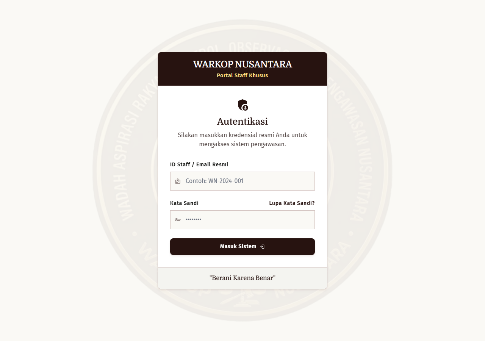

1. Buka `https://staf.<domain>/login`.
2. Pada kolom **ID Staff / Email Resmi**, ketik **alamat email** akun Anda
   (walaupun contoh di kolom bertuliskan `WN-2024-001`, yang dipakai sistem
   adalah email).
3. Ketik **Kata Sandi**.
4. Tekan **Masuk Sistem**. Bila berhasil muncul tulisan "Berhasil masuk
   sebagai …" lalu Anda dibawa ke Dashboard.

Pesan yang mungkin muncul:

| Pesan | Artinya | Yang perlu dilakukan |
|---|---|---|
| "Email atau kata sandi tidak sesuai" | Salah ketik, atau akun Anda **nonaktif**. Sistem sengaja tidak membedakan keduanya. | Periksa ejaan. Bila tetap gagal, hubungi superadmin. |
| "Terlalu banyak percobaan masuk. Coba lagi dalam N menit." | Terlalu banyak percobaan gagal (dari komputer Anda: 20 kali dalam 15 menit; untuk satu akun dari mana pun: 30 kali). | Tunggu sesuai waktu yang disebut. Ini bukan penguncian permanen. |
| "Tidak dapat menghubungi server" | Internet terputus atau server sedang bermasalah. | Periksa koneksi, coba lagi, lalu hubungi pengelola teknis. |

### 2.2 Keluar (logout)

Tekan **Keluar** di bagian bawah bilah kiri. **Selalu keluar** bila selesai,
terutama di komputer bersama. Sesi juga berakhir sendiri setelah beberapa waktu.

### 2.3 Mengganti kata sandi sendiri

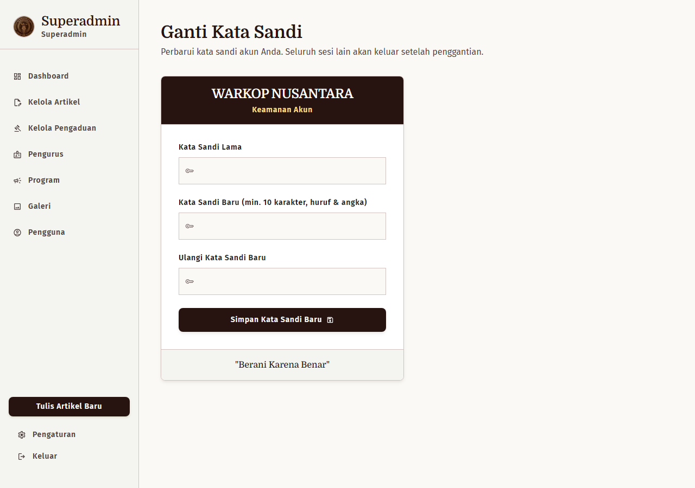

Halaman ini **tidak ada di menu**. Cara membukanya: ketik alamat
`https://staf.<domain>/staf/ganti-sandi` di peramban setelah masuk.

1. Isi **Kata Sandi Lama**.
2. Isi **Kata Sandi Baru**. Syarat: **minimal 10 karakter** dan **memuat huruf
   dan angka**. Harus berbeda dari kata sandi lama.
3. Ulangi kata sandi baru pada kolom **Ulangi Kata Sandi Baru**.
4. Tekan **Simpan Kata Sandi Baru**. Anda dibawa kembali ke Dashboard, dan
   **seluruh sesi lain** (misalnya di ponsel) otomatis dikeluarkan.

Pesan galat yang mungkin muncul: "Kata sandi lama tidak sesuai",
"Kata sandi minimal 10 karakter", "Kata sandi harus memuat huruf dan angka",
"Kata sandi baru harus berbeda dari yang lama", "Ulangi kata sandi baru tidak sama".

### 2.4 Bila Anda LUPA kata sandi

Tautan **"Lupa Kata Sandi?"** di halaman login hanya membawa ke halaman kontak
situs publik. **Sistem tidak bisa mengirim tautan reset lewat email.** Prosedurnya:

1. Hubungi **superadmin** (lihat bagian 9 untuk siapa yang dihubungi) dan
   sebutkan email akun Anda.
2. Superadmin membuka **Pengguna → ikon Reset Kata Sandi** pada baris Anda,
   membuat **kata sandi sementara**, lalu menyampaikannya kepada Anda lewat jalur
   yang aman (bukan grup obrolan umum).
3. Masuk dengan kata sandi sementara itu. Anda akan **dipaksa** ke halaman
   Ganti Kata Sandi (lihat 2.5).

### 2.5 Dipaksa mengganti kata sandi

Setelah superadmin mereset kata sandi Anda, setiap kali Anda membuka halaman
staf mana pun, sistem mengalihkan Anda ke halaman **Ganti Kata Sandi** dengan
keterangan "Kata sandi Anda baru saja disetel ulang oleh superadmin. Ganti
sekarang sebelum melanjutkan." Kolom pertama berlabel **Kata Sandi Sementara
(dari superadmin)**. Anda tidak bisa memakai menu lain sampai kata sandi
diganti. Setelah diganti, semuanya kembali normal.

### 2.6 Akun nonaktif

Superadmin dapat menonaktifkan akun (misalnya staf yang sudah tidak bertugas).
Akun nonaktif **tidak bisa masuk** dan pesan yang tampil sama dengan salah
sandi. Sesi yang sedang berjalan juga langsung berakhir. Riwayat tulisan dan
tindakan akun itu tetap tersimpan.

---

## 3. Dashboard

Dashboard adalah halaman pertama setelah masuk. Judulnya "Tinjauan
Pengawasan". Isinya menyesuaikan peran.

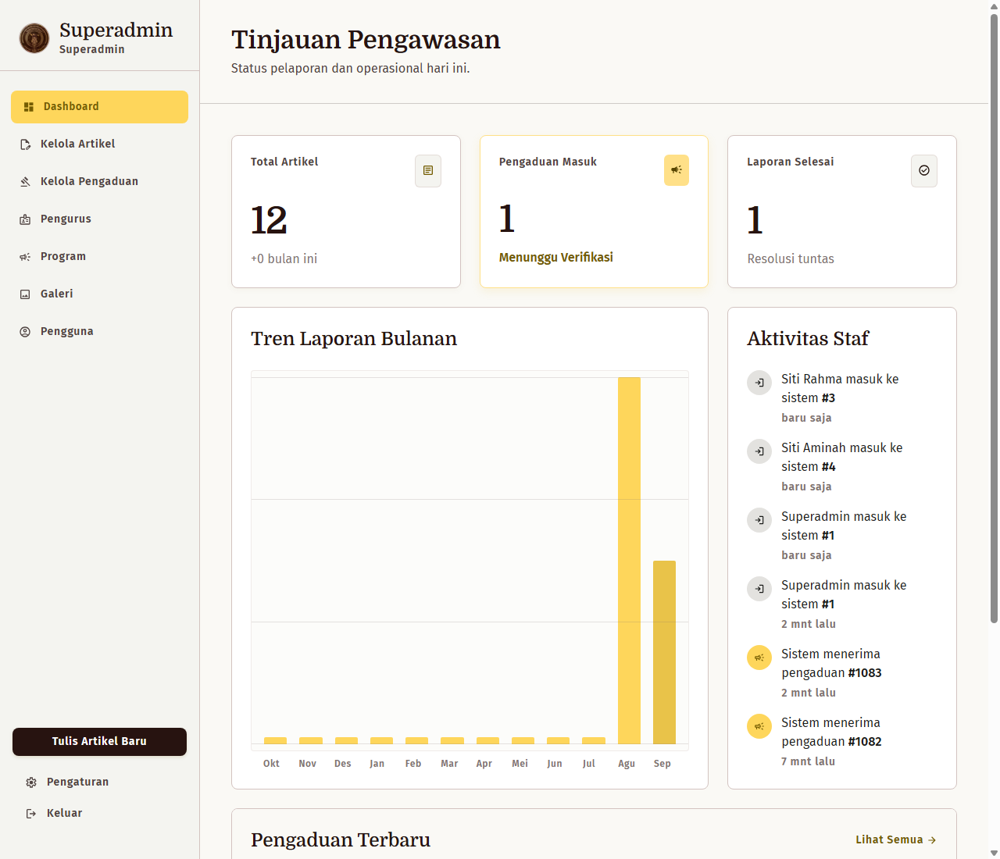

### 3.1 Tiga kartu angka (semua peran)

| Kartu | Arti |
|---|---|
| **Total Artikel** | Jumlah seluruh artikel di sistem (draf, terbit, arsip). Baris kecil "+N bulan ini" = artikel yang dibuat bulan berjalan. |
| **Pengaduan Masuk** — "Menunggu Verifikasi" | Jumlah pengaduan yang **masih berstatus Baru**, yaitu belum disentuh verifikator. Kartu ini berbingkai emas sebagai pengingat. |
| **Laporan Selesai** — "Resolusi tuntas" | Jumlah pengaduan berstatus **Selesai**. |

Untuk **Pimpinan Wilayah**, angka pengaduan hanya menghitung wilayahnya.

### 3.2 Grafik "Tren Laporan Bulanan"

Batang per bulan selama 12 bulan terakhir = jumlah pengaduan yang masuk pada
bulan itu. Batang paling kanan adalah bulan berjalan.

### 3.3 Panel kanan dan tabel bawah (berbeda tiap peran)

| Peran | Panel kanan | Tabel bawah |
|---|---|---|
| Superadmin | **Aktivitas Staf** — jejak tindakan terakhir (siapa masuk, siapa mengubah status, siapa membuka identitas pelapor, dst.) | Pengaduan Terbaru |
| Verifikator | **Menunggu Verifikasi** — daftar pengaduan berstatus Baru | Pengaduan Terbaru |
| Redaktur | **Draf Menunggu Terbit** — draf dari semua penulis yang perlu ditinjau | Artikel Terbaru |
| Penulis | **Draf Saya** | Artikel Terbaru (miliknya) |
| Pimpinan Wilayah | **Artikel Terbaru** wilayahnya | Pengaduan Terbaru wilayahnya |

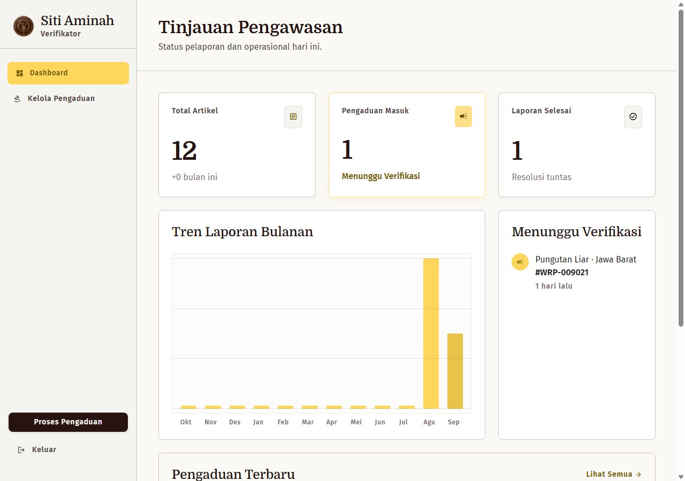

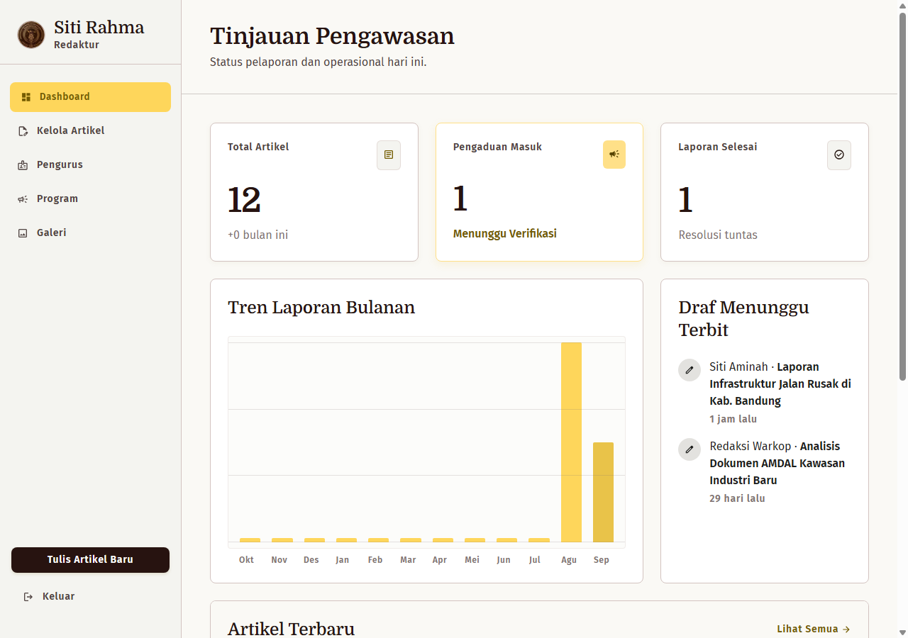

Tombol **Lihat Semua** di tabel bawah membuka daftar lengkap. Tombol besar di
bilah kiri ("Tulis Artikel Baru" atau "Proses Pengaduan") adalah jalan pintas
ke tugas utama peran Anda.

### 3.4 Penanda "langsung" (realtime)

Ruang staf tersambung langsung ke server, sehingga:

- **Pengaduan baru muncul sendiri** di Dashboard dan di daftar Kelola Pengaduan
  tanpa perlu memuat ulang halaman. Baris yang baru masuk disorot kuning sesaat,
  dan di pojok kanan bawah muncul keterangan singkat, misalnya "Pengaduan baru
  WRP-123456 · Jawa Barat" atau "WRP-123456: baru → diverifikasi".
- Bila Anda **sedang menyaring** daftar pengaduan (mencari, memilih status,
  atau berada di halaman 2 dst.), daftar **tidak** diubah di bawah tangan Anda.
  Sebagai gantinya muncul tombol **"Ada N laporan baru — muat ulang"** di pojok
  kanan bawah. Tekan untuk memuat.
- Bila muncul **"Sambungan langsung terputus — data diperbarui saat tersambung
  kembali"**, artinya koneksi langsung sedang putus. Halaman tetap bisa dipakai;
  data yang tertinggal akan disusulkan otomatis begitu tersambung. Bila penanda
  tidak hilang lama, periksa internet Anda.
- Pimpinan Wilayah hanya menerima pemberitahuan pengaduan wilayahnya.

---

## 4. Menulis dan menerbitkan artikel

Berlaku untuk **Penulis**, **Redaktur**, dan **Superadmin**. Pimpinan Wilayah
hanya bisa membaca.

### 4.1 Daftar artikel

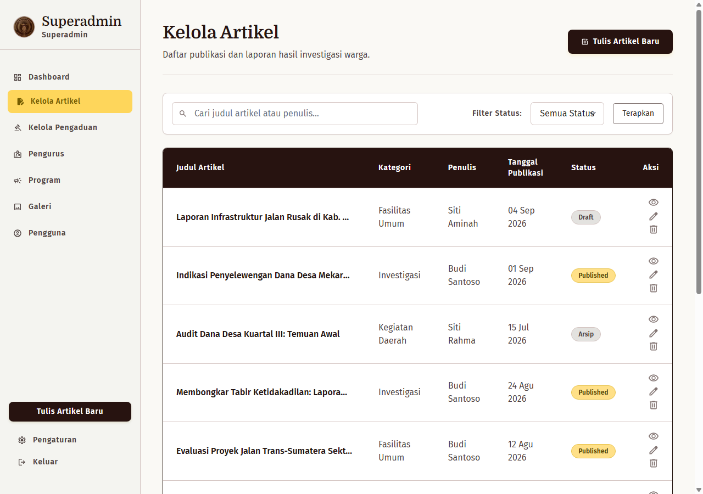

Menu **Kelola Artikel** menampilkan tabel: Judul, Kategori, Penulis, Tanggal
Publikasi, Status, Aksi.

- **Status**: `Draft` (belum tampil di publik), `Published` (tampil di situs
  publik), `Arsip` (pernah terbit, kini disembunyikan).
- Kotak **Cari judul artikel atau penulis** + **Filter Status** + tombol
  **Terapkan** untuk menyaring.
- Ikon **mata** = lihat (artikel terbit dibuka di situs publik; draf dibuka di
  editor). Ikon **pensil** = sunting. Ikon **tempat sampah** = hapus (hanya
  Redaktur/Superadmin).
- Penulis hanya melihat artikel miliknya sendiri.

### 4.2 Membuat draf baru

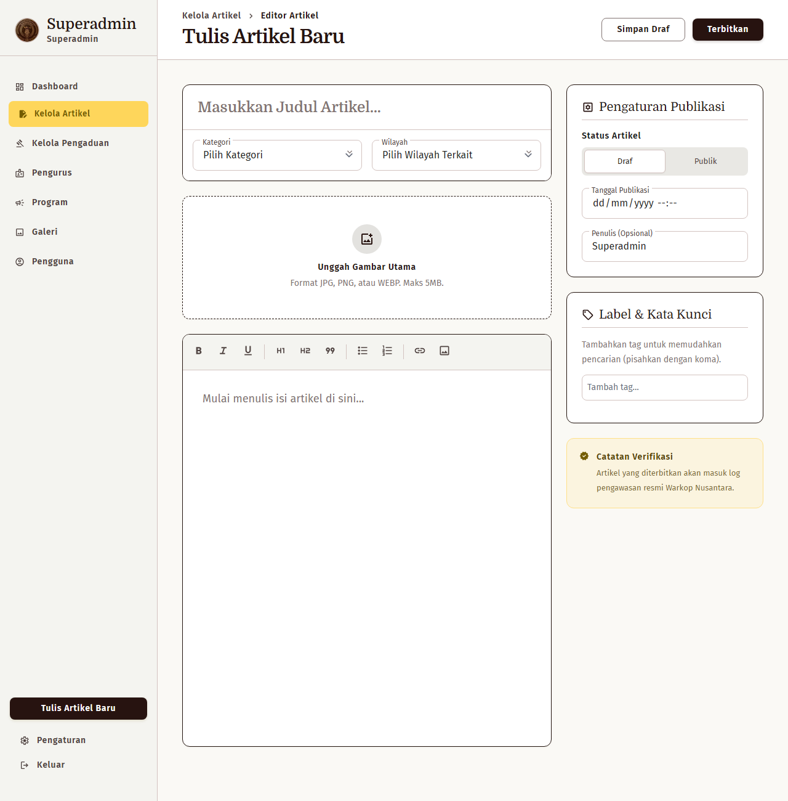

1. Tekan **Tulis Artikel Baru** (kanan atas, atau tombol besar di bilah kiri).
2. Isi kolom-kolom berikut:

   | Kolom | Keterangan |
   |---|---|
   | **Judul** (kolom besar paling atas, "Masukkan Judul Artikel...") | Wajib, minimal 5 karakter. |
   | **Kategori** | **Wajib.** Artikel tanpa kategori tidak bisa disimpan maupun diterbitkan. Pilihan berasal dari daftar yang dikelola pengelola teknis (contoh: Investigasi, Fasilitas Umum, Kegiatan Daerah). |
   | **Wilayah** | Opsional. Pilih bila artikel berkaitan dengan satu provinsi. Menentukan apakah Pimpinan Wilayah provinsi itu bisa membacanya. |
   | **Unggah Gambar Utama** | Opsional. Klik kotak putus-putus, pilih berkas **JPG, PNG, atau WEBP, maksimal 5 MB**. Gambar diperkecil otomatis oleh server. |
   | **Isi artikel** ("Mulai menulis isi artikel di sini...") | Wajib, minimal 10 karakter. Bilah alat di atasnya: **B** tebal, *I* miring, U garis bawah, H1/H2 judul bagian, 99 kutipan, daftar butir/bernomor, sisipkan tautan (hanya alamat `http://` atau `https://`), sisipkan gambar (aturan sama dengan gambar utama). |
   | **Ringkasan** | Tidak perlu diisi. Sistem membuatnya otomatis dari 200 karakter pertama isi setiap kali disimpan. |
   | **Status Artikel** (Draf / Publik) | **Hanya penanda**, bukan tombol. Untuk menerbitkan gunakan tombol **Terbitkan**. |
   | **Tanggal Publikasi** | Diisi otomatis (WIB) saat artikel diterbitkan; tidak bisa diketik. |
   | **Penulis (Opsional)** | Terisi otomatis dengan nama Anda; tidak bisa diubah. |
   | **Label & Kata Kunci** (tag) | Opsional. Ketik lalu tekan Enter atau koma; maksimal 10 tag, 40 karakter per tag. |

3. Tekan **Simpan Draf**. Muncul "Perubahan tersimpan." dan alamat halaman
   berubah menjadi halaman sunting artikel itu. Anda bisa kembali kapan saja
   lewat Kelola Artikel.

### 4.3 "Mengirim" draf ke redaktur

Sistem **tidak punya tombol "kirim ke redaktur"** dan tidak mengirim
pemberitahuan. Alurnya sederhana:

1. Penulis menyimpan draf sampai dirasa siap.
2. Draf itu otomatis muncul di panel **"Draf Menunggu Terbit"** pada Dashboard
   Redaktur dan di Kelola Artikel dengan filter status `Draft`.
3. Sebaiknya penulis memberi tahu redaktur lewat jalur komunikasi biasa (rapat,
   telepon, pesan) bahwa draf sudah siap.

### 4.4 Menerbitkan (Redaktur dan Superadmin saja)

1. Buka draf dari Kelola Artikel (ikon pensil) atau dari panel "Draf Menunggu
   Terbit".
2. Periksa isi, kategori, gambar. Sunting seperlunya.
3. Tekan **Terbitkan** (tombol gelap kanan atas). Sistem menyimpan perubahan
   lebih dulu, lalu menerbitkan. Muncul "Artikel berhasil diterbitkan." disertai
   tautan **"Lihat di portal publik"**.
4. Artikel kini berstatus `Published`, tampil di halaman Berita situs publik,
   dan diumumkan ke staf lain lewat penanda realtime ("Artikel terbit: …").

Tombol Terbitkan **tidak tampil** untuk Penulis. Menerbitkan juga dicatat di
jejak audit.

Menyunting artikel yang **sudah terbit** lalu menekan **Simpan Draf** hanya
menyimpan perubahannya; artikel tetap berstatus terbit (tombol itu tidak
menarik artikel dari publik).

### 4.5 Tautan publik (slug)

Alamat artikel di situs publik berbentuk
`https://<domain>/berita/<slug>`. **Slug dibuat otomatis** dari judul (huruf
kecil, spasi menjadi tanda hubung, tanpa tanda baca) dan dijamin unik. Anda
tidak perlu dan tidak bisa mengetiknya sendiri.

### 4.6 Mengarsipkan

Status `Arsip` berarti artikel disembunyikan dari publik tanpa dihapus. Saat
ini **belum ada tombol Arsipkan di layar**; bila perlu mengarsipkan artikel,
minta bantuan pengelola teknis. Artikel berstatus Arsip tetap tampil di Kelola
Artikel (filter "Arsip") dan bisa disunting.

### 4.7 Menghapus (Redaktur dan Superadmin saja)

1. Di Kelola Artikel, tekan ikon **tempat sampah** pada baris artikel.
2. Muncul kotak **Hapus Artikel**: "Artikel … akan dihapus permanen beserta tag
   dan riwayat bacanya. Tindakan ini tidak dapat dibatalkan."
3. Tekan **Hapus** untuk melanjutkan atau **Batal**.

Menghapus tidak bisa dibatalkan. Bila ragu, biarkan sebagai draf atau minta
diarsipkan.

---

## 5. Menindaklanjuti pengaduan

Berlaku untuk **Verifikator** dan **Superadmin** (bisa mengubah). **Pimpinan
Wilayah** hanya bisa membaca pengaduan wilayahnya, tanpa identitas pelapor.

### 5.1 Dari mana pengaduan datang

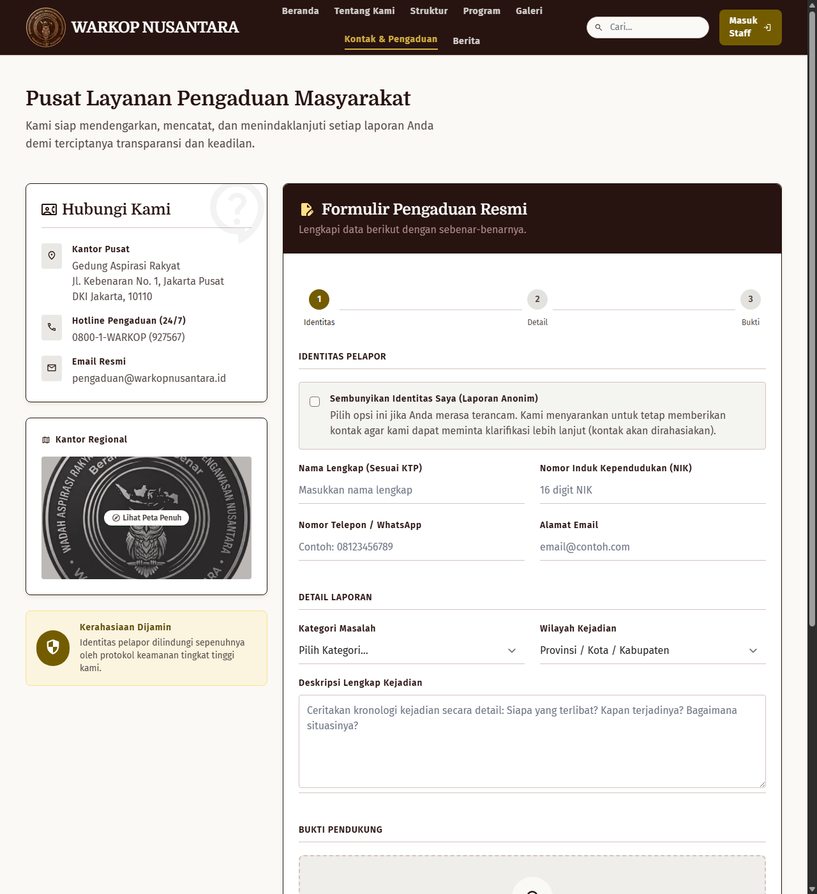

Masyarakat mengisi formulir di halaman **Kontak & Pengaduan** situs publik.
Yang mereka isi:

- **Sembunyikan Identitas Saya (Laporan Anonim)** — bila dicentang, kolom
  nama/NIK/telepon/email **tidak dikirim sama sekali** ke server. Laporan anonim
  benar-benar tidak punya identitas; tidak ada yang bisa "membukanya".
- Bila tidak anonim: **Nama Lengkap** (wajib), **NIK** (opsional, harus 16
  digit), dan **minimal salah satu** dari telepon atau email.
- **Kategori Masalah** (wajib): Tindak Pidana Korupsi, Buruknya Pelayanan Publik,
  Sengketa Agraria / Tanah, Kerusakan Infrastruktur, Pencemaran Lingkungan,
  Ketenagakerjaan, Pungutan Liar, Lainnya.
- **Wilayah Kejadian** (provinsi, opsional).
- **Deskripsi Lengkap Kejadian** (wajib, minimal 30 karakter).
- **Bukti Pendukung**: hingga 5 berkas, masing-masing maksimal 20 MB, total
  40 MB; format JPG, PNG, WebP, PDF, atau MP4.

Setelah dikirim, pelapor menerima **Nomor Kasus** berformat `WRP-XXXXXX`
(enam angka acak). Nomor ini satu-satunya "kunci" pelapor untuk melacak. Sistem
**tidak mengirim email/SMS/WhatsApp** apa pun kepada pelapor.

### 5.2 Daftar pengaduan dan penyaringan

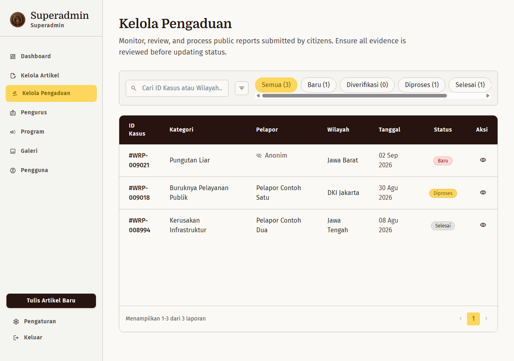

Menu **Kelola Pengaduan** menampilkan tabel: ID Kasus, Kategori, Pelapor,
Wilayah, Tanggal, Status, Aksi.

- **Pil status** di atas tabel: **Semua (N), Baru (N), Diverifikasi (N),
  Diproses (N), Selesai (N), Ditolak (N)**. Klik untuk menyaring; angka dalam
  kurung adalah jumlah. Geser ke kanan bila pil tidak muat.
- Kotak **Cari ID Kasus atau Wilayah** lalu tekan ikon saring di sebelahnya
  (mencari di nomor kasus dan isi deskripsi).
- Kolom **Pelapor** menampilkan nama untuk Verifikator/Superadmin. Untuk
  laporan anonim tertulis **"Anonim"** dengan ikon mata dicoret. Untuk Pimpinan
  Wilayah, laporan bernama tampil sebagai **"Dirahasiakan"**.
- Ikon **mata** di kolom Aksi membuka halaman detail.
- Halaman berikutnya lewat angka/panah di kanan bawah ("Menampilkan 1-10 dari N
  laporan").
- Pimpinan Wilayah hanya melihat pengaduan yang wilayahnya sama dengan wilayah
  akunnya; pengaduan tanpa wilayah tidak tampil baginya.

### 5.3 Halaman detail

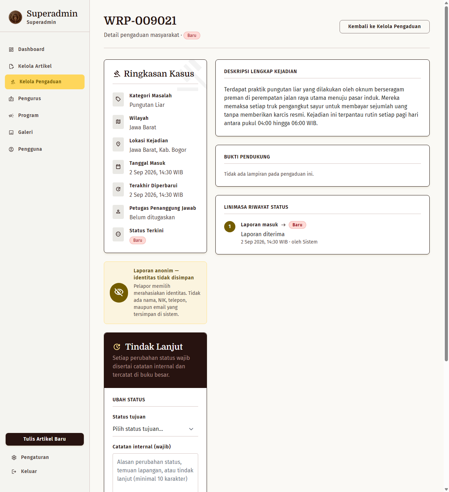

Judul halaman = nomor kasus, disertai lencana status. Tombol **Kembali ke Kelola
Pengaduan** di kanan atas.

Kolom kiri:

- **Ringkasan Kasus**: kategori, wilayah, lokasi kejadian, tanggal masuk,
  terakhir diperbarui, petugas penanggung jawab, status terkini.
- **Panel identitas** (hanya Verifikator/Superadmin — lihat 5.6).
- **Tindak Lanjut**: ubah status dan penugasan petugas (lihat 5.4 dan 5.5).
  Panel ini **tidak tampil** untuk Pimpinan Wilayah.

Kolom kanan:

- **Deskripsi Lengkap Kejadian** — teks asli pelapor.
- **Bukti Pendukung** — daftar lampiran (lihat 5.7).
- **Linimasa Riwayat Status** — setiap perubahan: status lama → status baru,
  catatan internal, waktu (WIB), dan nama staf yang mengubah. Baris pertama
  selalu "Laporan masuk → Baru · Laporan diterima · oleh Sistem".

### 5.4 Arti setiap status dan urutan yang lazim

| Status | Arti untuk staf | Yang dibaca pelapor di halaman Lacak |
|---|---|---|
| **Baru** | Laporan masuk, belum diperiksa. Status otomatis saat pelapor mengirim. | "Laporan sudah kami terima dan menunggu pemeriksaan awal oleh verifikator." |
| **Diverifikasi** | Verifikator sudah membaca, menilai kelengkapan dan kewenangan, dan memutuskan layak ditindaklanjuti. | "Laporan telah diperiksa kelengkapannya dan dinyatakan layak ditindaklanjuti." |
| **Diproses** | Sedang ditangani: klarifikasi, pengumpulan bukti, koordinasi dengan pihak terkait, pendampingan. | "Tim kami sedang menangani laporan ini bersama pihak-pihak terkait." |
| **Selesai** | Penanganan rampung, kasus ditutup. | "Penanganan laporan telah dirampungkan dan kasus ditutup." |
| **Ditolak** | Tidak dapat ditindaklanjuti: di luar kewenangan, bukti tidak memadai, fitnah/ujaran kebencian, duplikat. | "Laporan tidak dapat kami tindaklanjuti, misalnya karena di luar kewenangan atau bukti tidak memadai." |

Urutan yang lazim: **Baru → Diverifikasi → Diproses → Selesai**. **Ditolak**
biasanya dari Baru atau Diverifikasi. Sistem sendiri tidak memaksa urutan
(status apa pun bisa dipilih), tetapi ikutilah urutan di atas agar linimasa yang
dibaca pelapor masuk akal. Kalau terlanjur salah, ubah lagi ke status yang benar
dengan catatan yang menjelaskan koreksinya — setiap langkah tetap tercatat.

### 5.5 Mengubah status dan menulis catatan internal

Pada panel **Tindak Lanjut → Ubah Status**:

1. Pilih **Status tujuan** (status saat ini tidak ada di daftar).
2. Tulis **Catatan internal (wajib)** — **minimal 10 karakter**. Isi dengan
   alasan perubahan, temuan lapangan, atau langkah tindak lanjut. Tulislah
   seperti berkas resmi: singkat, faktual, bisa dipahami rekan lain.
3. Tekan **Simpan Perubahan Status**. Muncul pesan: Status diubah menjadi "…"
   dan tercatat di riwayat.

Ketentuan catatan:

- **Tidak bisa diubah atau dihapus** setelah disimpan (buku besar).
- **Hanya terlihat oleh staf.** Pelapor di halaman Lacak hanya melihat nama
  status dan waktunya, **tidak pernah** isi catatan maupun nama petugas.
- Jangan menyalin nama/NIK/telepon pelapor ke dalam catatan. Identitas sudah
  tersimpan di tempatnya sendiri yang terjaga; catatan dibaca oleh peran yang
  lebih luas (termasuk Pimpinan Wilayah).

Bila muncul "Catatan internal wajib diisi (minimal 10 karakter)" atau "Pilih
status tujuan lebih dulu", lengkapi lalu simpan lagi.

### 5.6 Menugaskan petugas

Pada panel **Tindak Lanjut → Penugasan Petugas**:

1. Pilih nama pada **Petugas penanggung jawab** (daftar berisi staf yang berhak
   memproses pengaduan; pilih "— Belum ditugaskan —" untuk melepas).
2. Tekan **Simpan Penugasan**. Muncul "Petugas ditugaskan." atau "Penugasan
   dihapus."

Penugasan adalah penanda siapa yang memegang kasus; nama petugas **tidak**
ditampilkan kepada pelapor. Penugasan tercatat di jejak audit.

### 5.7 Melihat identitas pelapor (Verifikator dan Superadmin saja)

- Untuk laporan **tidak anonim**, panel emas **"DATA SENSITIF — Identitas
  Pelapor"** menampilkan Nama Lengkap, NIK, Nomor Telepon/WhatsApp, dan Alamat
  Email. Panel ini **hanya dikirim ke layar** Verifikator dan Superadmin; peran
  lain tidak menerimanya sama sekali (bukan sekadar disembunyikan).
- **Setiap kali** Anda membuka halaman detail laporan bernama, sistem mencatat
  di jejak audit: siapa, kapan, dari alamat IP mana. Superadmin melihatnya di
  panel Aktivitas Staf ("… membuka identitas pelapor pengaduan #…"). Buka hanya
  bila memang perlu.
- Untuk laporan **anonim**, panel bertuliskan "Laporan anonim — identitas tidak
  disimpan". Tidak ada yang bisa dibuka oleh siapa pun, termasuk superadmin.
- Gunakan kontak pelapor hanya untuk klarifikasi kasus. Jangan disalin ke
  catatan, pesan, tangkapan layar, atau berkas di luar sistem.

### 5.8 Lampiran (Bukti Pendukung)

- Setiap lampiran tampil dengan nama berkas, jenis (Gambar / Dokumen PDF /
  Video), dan ukuran. Gambar dipratinjau langsung; PDF dan video diunduh lewat
  ikon di kanan.
- Lampiran hanya bisa dibuka oleh staf yang berhak melihat pengaduan itu, dan
  **setiap pembukaan tercatat** di jejak audit.
- Perlakukan berkas unduhan seperti dokumen rahasia: simpan di komputer kantor,
  hapus bila tidak diperlukan.

### 5.9 Apa yang dilihat pelapor di halaman Lacak

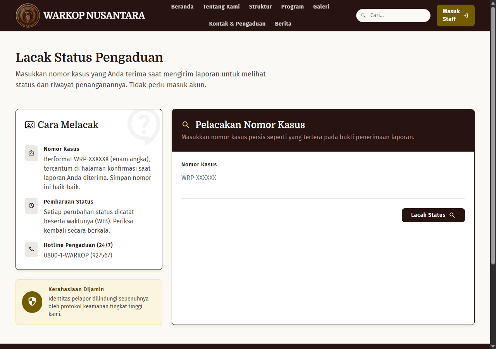

Pelapor membuka `https://<domain>/lacak`, mengetik nomor kasus, menekan
**Lacak Status**, dan melihat:

- Nomor kasus, lencana status, kategori, wilayah, tanggal masuk, terakhir
  diperbarui.
- **Linimasa Penanganan**: urutan status beserta waktunya (WIB).
- Penjelasan arti setiap status (teks pada tabel 5.4).

Yang **tidak pernah** tampil kepada pelapor: identitas, catatan internal, nama
petugas, lampiran. Nomor yang salah atau tidak ada dibalas dengan pesan netral
yang sama, sehingga orang tidak bisa menebak-nebak nomor.

Karena itulah **setiap perubahan status Anda langsung dibaca pelapor**.
Jangan mengubah status "sekadar mencoba".

---

## 6. Konten situs

Berlaku untuk **Redaktur** dan **Superadmin**. Pimpinan Wilayah hanya membaca.
Perubahan di sini **langsung tampil** di situs publik tanpa langkah "terbitkan".

Pola ketiga modul sama: tombol **Tambah …** di kanan atas membuka formulir di
atas tabel; ikon **pensil** menyunting; ikon **tempat sampah** menghapus
(dengan kotak konfirmasi); **Simpan** menyimpan; **Batal** menutup formulir.

### 6.1 Pengurus (halaman Struktur Organisasi)

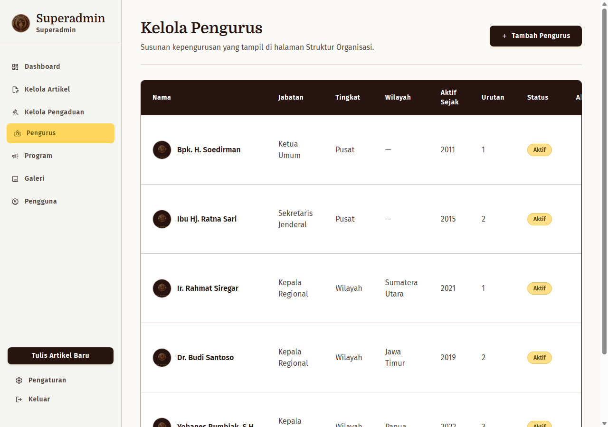

Kolom formulir: **Nama Lengkap** (beserta gelar), **Jabatan** (mis. Ketua
Umum), **Tingkat** (Pusat / Wilayah), **Wilayah** (wajib bila tingkat
Wilayah), **Foto** (JPG/PNG/WEBP maks 5 MB), **Deskripsi (Opsional)**,
**Aktif Sejak (Tahun)**, **Urutan Tampil**, kotak centang **Aktif (tampil di
halaman Struktur)**.

Mengatur urutan tampil:

1. Di kolom **Aksi** setiap baris ada tombol **▲ (Naik)** dan **▼ (Turun)**.
2. Satu klik menukar posisi dengan tetangga **di tingkat yang sama** (pusat
   dengan pusat, wilayah dengan wilayah) dan langsung tersimpan: "Urutan
   tersimpan dan langsung berlaku di halaman Struktur Organisasi."

Pengurus yang tidak dicentang Aktif tetap ada di tabel (lencana **Nonaktif**)
tetapi tidak tampil di publik — cara aman untuk pergantian pengurus tanpa
menghapus.

### 6.2 Program

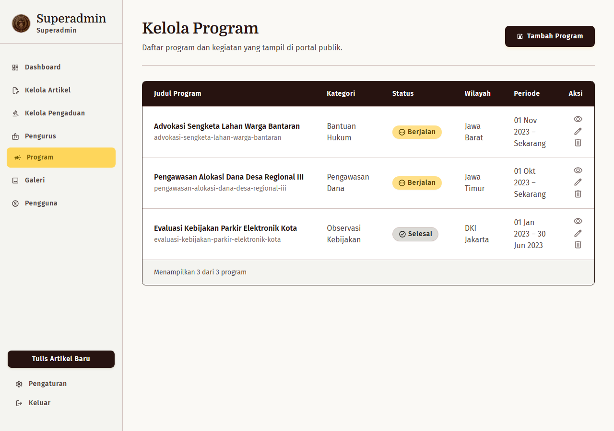

Kolom formulir: **Judul Program**, **Kategori** (Pengawasan Dana / Observasi
Kebijakan / Bantuan Hukum), **Wilayah** (opsional), **Gambar** (JPG/PNG/WEBP
maks 5 MB; tombol **Lepas Gambar** untuk menghapusnya), **Ringkasan** (maks
600 karakter, tampil di kartu program), **Uraian lengkap**, **Status**
(Berjalan / Selesai), **Tanggal Mulai**, **Tanggal Selesai** (kosongkan bila
masih berjalan), **Slug (otomatis)** dibuat server dari judul.

Di tabel, kolom Periode menampilkan "tanggal mulai – Sekarang" bila tanggal
selesai kosong. Ikon **mata** membuka halaman program di situs publik.

### 6.3 Galeri (foto dan video)

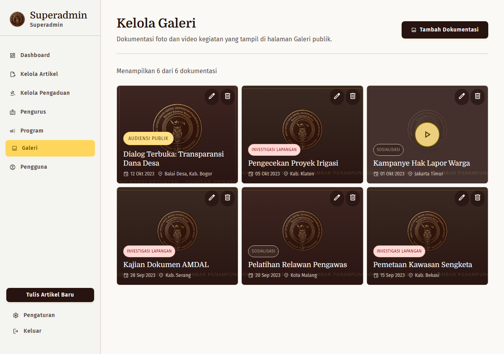

Tombol **Tambah Dokumentasi**. Kolom formulir: **Judul**, **Deskripsi**,
**Jenis** (Foto / Video), **Kategori** (Investigasi Lapangan / Sosialisasi /
Audiensi Publik), **Wilayah**, **Lokasi** (mis. "Balai Desa, Kab. Bogor"),
**Tanggal Kegiatan**, **Berkas** (wajib), **Thumbnail (Opsional)** untuk video.

Aturan berkas:

- **Foto**: JPG, PNG, atau WebP.
- **Video**: hanya **MP4**. Gambar sampul (thumbnail) **tidak dibuat
  otomatis**; unggah sendiri satu gambar sebagai thumbnail agar kartu video
  tidak memakai logo penampung.
- Batas ukuran berkas galeri mengikuti setelan server (bawaan **20 MB**); angka
  pastinya tertulis di formulir.
- Server memeriksa isi berkas, bukan hanya namanya. Berkas yang "berganti
  ekstensi" ditolak.

Kartu galeri di halaman ini sama dengan tampilan publik; ikon pensil dan tempat
sampah ada di pojok kanan atas setiap kartu.

### 6.4 Pengaturan situs (Superadmin saja)

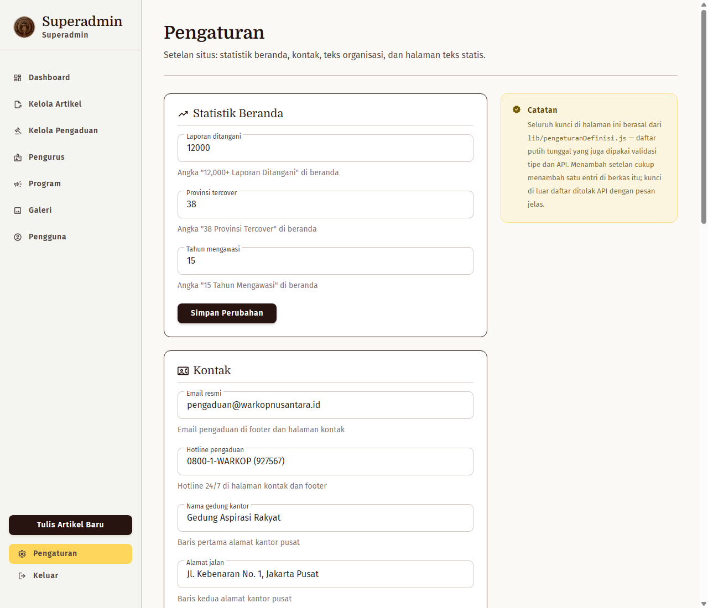

Menu **Pengaturan** memuat 13 setelan dalam empat kelompok. **Setiap kelompok
punya tombol "Simpan Perubahan" sendiri** — menyimpan satu kelompok tidak
menyentuh kelompok lain.

| Kelompok | Setelan | Tampil di mana |
|---|---|---|
| **Statistik Beranda** | Laporan ditangani; Provinsi tercover; Tahun mengawasi (ketiganya angka) | Tiga angka besar di beranda ("12,000+ Laporan Ditangani", dst.). Angka ini **diketik manual**, bukan dihitung otomatis. |
| **Kontak** | Email resmi; Hotline pengaduan; Nama gedung kantor; Alamat jalan; Kota & kode pos | Kartu "Hubungi Kami" di halaman Kontak dan footer situs. |
| **Teks Organisasi** | Visi; Misi (satu butir per baris) | Halaman Tentang Kami. |
| **Halaman Teks Statis** | Kebijakan Privasi; Pedoman Komunitas; FAQ (pasangan tanya-jawab dipisah baris kosong) | Halaman `/kebijakan-privasi`, `/pedoman-komunitas`, `/faq` (tautan di footer). Teks bawaannya masih berupa penampung yang berbunyi "akan disempurnakan oleh pengurus lembaga" — **ganti dengan teks resmi lembaga**. |

Nama, logo, dan menu situs **tidak** diatur di sini; perubahan itu perlu
pengelola teknis.

---

## 7. Kelola pengguna (superadmin)

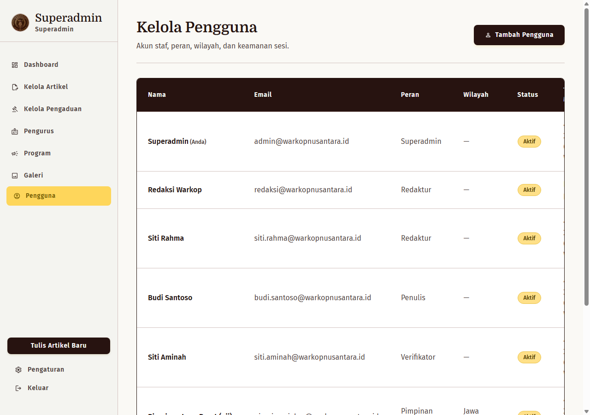

Menu **Pengguna** menampilkan tabel: Nama, Email, Peran, Wilayah, Status
(Aktif / Nonaktif, dan penanda "Wajib ganti sandi"), Terakhir Masuk, dan ikon
aksi: **Edit**, **Paksa Keluar**, **Reset Kata Sandi**, **Delete**. Baris akun
Anda sendiri ditandai "(Anda)" dan tidak punya tombol hapus.

### 7.1 Menambah akun

1. Tekan **Tambah Pengguna**.
2. Isi **Nama Lengkap** (min. 3 karakter), **Email Resmi** (unik, dipakai untuk
   login), **Peran**, **Wilayah** (**wajib** untuk Pimpinan Wilayah; abaikan
   untuk peran lain), **Kata Sandi Awal** (min. 10 karakter, huruf dan angka),
   centang **Akun aktif (dapat masuk ke ruang staf)**.
3. Tekan **Simpan Pengguna**.
4. Sampaikan email dan kata sandi awal kepada yang bersangkutan lewat jalur aman,
   lalu minta ia segera mengganti sandinya (bagian 2.3).

### 7.2 Mengubah peran, wilayah, atau status aktif

1. Tekan ikon **Edit** pada baris pengguna.
2. Ubah kolom yang perlu; tekan **Simpan Perubahan**.
3. Mengubah peran atau menonaktifkan akun **langsung mengeluarkan** sesi
   pengguna itu.

Perlindungan yang dipasang sistem:

- Anda **tidak bisa** mengubah peran atau menonaktifkan **akun Anda sendiri**
  (kotak dan pilihan terkunci; pesan: "Peran dan status aktif akun Anda sendiri
  tidak dapat diubah dari sini").
- Sistem menolak menonaktifkan, menurunkan peran, atau menghapus **superadmin
  terakhir yang aktif** — agar sistem tidak terkunci tanpa pengelola.

### 7.3 Nonaktifkan vs hapus

- **Nonaktifkan** (Edit → hilangkan centang Aktif) adalah cara yang **benar**
  untuk staf yang berhenti. Akun tidak bisa masuk, tetapi nama mereka tetap
  tercatat pada artikel, riwayat pengaduan, dan jejak audit.
- **Hapus** (ikon tempat sampah) hanya berhasil untuk akun yang **belum pernah
  meninggalkan jejak** (misalnya akun salah buat yang belum dipakai). Bila akun
  sudah punya artikel, riwayat status, penugasan, atau catatan audit, sistem
  menolak dengan pesan "Pengguna memiliki jejak (…) sehingga tidak dapat dihapus
  — nonaktifkan akunnya saja", dan kotak dialog menawarkan tombol untuk
  **menonaktifkan** sebagai gantinya.

### 7.4 Reset kata sandi

1. Tekan ikon **Reset Kata Sandi** pada baris pengguna.
2. Ketik **Kata Sandi Baru** sementara (min. 10 karakter, huruf dan angka).
3. Tekan **Setel Ulang**. Pesan: "Kata sandi … disetel ulang. Sesi lamanya
   dikeluarkan dan ia wajib mengganti kata sandi saat login berikutnya."
4. Sampaikan sandi sementara lewat jalur aman. Saat masuk, pengguna dipaksa
   menggantinya (bagian 2.5). Tindakan ini tercatat di jejak audit.

### 7.5 Paksa keluar

Tekan ikon **Paksa Keluar** → **Paksa Keluar**. Seluruh sesi pengguna itu di
semua perangkat langsung batal ("Seluruh sesi … telah dikeluarkan. Token lama
tidak berlaku lagi."). Gunakan bila ada dugaan akun dipakai orang lain atau
perangkat hilang. Memaksa keluar akun sendiri akan mengembalikan Anda ke halaman
login.

---

## 8. Etika dan keamanan

Aturan yang wajib dipegang setiap staf:

1. **Identitas pelapor tidak pernah keluar dari sistem.** Jangan menyebut nama,
   NIK, telepon, atau email pelapor di catatan internal, grup pesan, rapat
   terbuka, tangkapan layar, atau dokumen lain. Bila perlu merujuk, pakai nomor
   kasus.
2. **Buka identitas hanya bila perlu.** Setiap pembukaan tercatat dengan nama
   Anda, waktu, dan alamat IP, dan diperiksa superadmin.
3. **Keluar setelah selesai**, kunci layar bila meninggalkan meja, jangan
   memakai komputer umum/warnet untuk ruang staf.
4. **Kata sandi**: minimal 10 karakter dengan huruf dan angka; jangan sama
   dengan kata sandi layanan lain; jangan dibagikan; jangan ditulis di kertas
   yang menempel di layar. Superadmin tidak pernah memerlukan kata sandi Anda.
5. **Satu orang, satu akun.** Jangan berbagi akun; jejak audit hanya berguna
   bila menunjuk orang yang benar.
6. **Perubahan status dibaca pelapor.** Jangan mengubah status untuk coba-coba.
   Catatan internal permanen; tulis dengan cermat.
7. **Laporkan hal mencurigakan** ke superadmin: masuk yang tidak Anda lakukan
   (lihat "Terakhir Masuk" atau Aktivitas Staf), email/pesan yang meminta kata
   sandi, perangkat hilang, atau tampilan sistem yang tidak biasa. Superadmin
   dapat memaksa keluar dan mereset sandi dalam hitungan detik.
8. **Berkas bukti** (lampiran) yang diunduh disimpan hanya di perangkat kantor
   dan dihapus bila tidak lagi diperlukan.

### Yang TIDAK bisa dilakukan sistem (jangan berasumsi ada)

- **Tidak mengirim email, SMS, atau WhatsApp** kepada pelapor maupun staf —
  tidak ada notifikasi otomatis saat status berubah, saat draf siap, atau saat
  akun dibuat. Komunikasi ke pelapor dilakukan manual lewat kontak yang ia
  berikan (bila bukan anonim).
- **Tidak ada "lupa kata sandi" mandiri**; reset hanya lewat superadmin.
- **Tidak ada pesan/balasan kepada pelapor lewat sistem**; pelapor hanya melihat
  status dan waktunya di halaman Lacak.
- **Tidak ada kotak komentar antar-staf** di artikel maupun pengaduan; gunakan
  catatan internal (pengaduan) atau jalur komunikasi lembaga.
- **Tidak membuat thumbnail video** otomatis; unggah sendiri.
- **Tidak mengembalikan artikel yang dihapus.** Hapus bersifat permanen.
- **Tidak menghapus atau menyunting catatan internal** yang sudah disimpan.

---

## 9. Pertanyaan yang sering muncul

**1. Saya sudah masuk, tetapi menu Kelola Pengaduan tidak ada.**
Peran Anda tidak berhak (Redaktur/Penulis). Menu mengikuti peran; minta
superadmin bila memang tugas Anda menuntut peran lain.

**2. Saya membuka halaman pengaduan lewat tautan dari rekan, tetapi muncul
"tidak ditemukan" atau "tanpa akses".**
Untuk Pimpinan Wilayah, pengaduan di luar wilayah Anda memang tampak seolah
tidak ada. Untuk peran tanpa hak pengaduan, halaman ditolak. Ini disengaja.

**3. Saya penulis. Mengapa tombol Terbitkan tidak ada?**
Penulis hanya membuat dan menyunting draf miliknya. Menerbitkan adalah
kewenangan Redaktur/Superadmin (bagian 4.4).

**4. Artikel tidak bisa disimpan, pesannya tentang kategori.**
Kategori wajib. Pilih salah satu di kolom Kategori lalu simpan lagi.

**5. Gambar ditolak saat diunggah.**
Periksa: format JPG/PNG/WEBP, ukuran maksimal 5 MB (gambar artikel, pengurus,
program). Berkas dengan ekstensi diganti-ganti tetap ditolak karena server
memeriksa isinya. Ada juga batas 60 unggahan per jam per akun.

**6. Status pengaduan tidak bisa disimpan.**
Pastikan status tujuan sudah dipilih dan catatan internal minimal 10 karakter.
Bila pesannya "HTTP 403", peran Anda tidak berhak mengubah status.

**7. Saya salah memilih status. Bisa dibatalkan?**
Tidak bisa dihapus, tetapi bisa **diubah lagi** ke status yang benar dengan
catatan yang menjelaskan koreksi. Kedua langkah tetap tampil di linimasa
(termasuk bagi pelapor), jadi berhati-hatilah sejak awal.

**8. Pelapor menelepon menanyakan siapa yang menangani laporannya.**
Nama petugas dan catatan internal tidak untuk pelapor. Sampaikan status dan
langkah umum saja; arahkan ke halaman Lacak dengan nomor kasusnya.

**9. Laporan anonim — bagaimana menghubungi pelapornya?**
Tidak bisa. Tidak ada kontak yang tersimpan. Tindak lanjut hanya berdasarkan
isi laporan dan bukti.

**10. Nomor kasus pelapor hilang.**
Sistem tidak bisa mencari kasus berdasarkan nama pelapor untuk umum. Verifikator
dapat mencari di Kelola Pengaduan (kolom Pelapor untuk laporan bernama) dan
menyampaikan nomornya **hanya setelah** yakin penelepon adalah pelapor itu
sendiri. Untuk laporan anonim, tidak ada cara memulihkan nomor.

**11. Muncul "Sambungan langsung terputus" terus-menerus.**
Halaman tetap berfungsi; hanya pembaruan otomatis yang tertunda. Muat ulang
halaman (F5). Bila berlanjut di semua komputer, laporkan ke pengelola teknis.

**12. Saya ingin mengganti logo, nama menu, atau menambah kategori
artikel/pengaduan.**
Hal-hal itu bukan bagian dari Pengaturan; perlu pengelola teknis.

### Siapa yang dihubungi

| Masalah | Hubungi |
|---|---|
| Lupa kata sandi, akun terkunci/nonaktif, ganti peran/wilayah, dugaan akun disalahgunakan | **Superadmin** lembaga |
| Sistem tidak bisa dibuka, galat "server", berkas tidak bisa diunggah padahal sesuai aturan, perlu mengarsipkan artikel, perubahan logo/menu/kategori, pemulihan data | **Pengelola teknis** (melalui superadmin) |
| Pertanyaan tentang penanganan kasus, kebijakan status, atau isi catatan | **Koordinator verifikator** / pimpinan lembaga |

Simpan nomor kontak superadmin dan pengelola teknis di tempat yang mudah
dijangkau, di luar sistem ini.

---

*Panduan ini menggambarkan perilaku sistem pada versi saat ditulis. Bila layar
yang Anda lihat berbeda dari tangkapan layar di sini, laporkan ke pengelola
teknis agar panduan diperbarui.*
